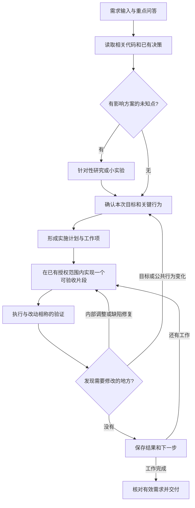

# FrameWork_Ranger AI 开发工作流优化

> 日期：2026-09-04  
> 状态：2026-09-05 用户授权落地；自然语言入口、JSON 记忆与轻量流程已接入，工具扩展仍按需讨论。  
> 适用范围：新模块、新功能及跨多轮上下文的长任务，重点考虑持续 8 小时以上的开发。  
> 产物：项目 AGENTS、已有个人 Skills 与流程文档、两份 JSON 模板；未新增 Unity CLI 能力。

## 1. 优化目标与本轮共识

本次优化优先解决长任务中需求遗失、重复解释、重复调查和收尾遗漏，同时控制流程维护成本。保留现有“需求、设计、计划、实现、验证”的基本组织方式，增加可以持续读取和更新的任务记忆，允许设计随新事实调整。

以下方向来自本轮用户反馈，可以作为后续讨论和试点的依据：

| 已确认方向 | 对工作流的影响 |
| --- | --- |
| 项目已经接入 Unity 6 CLI，可以考虑补充有用的工具 | 先复用现有入口，按实际缺口扩展；不从零建设另一套开发平台 |
| 新模块设计需要保留修改空间 | 允许研究、小实验和局部调整，避免一开始冻结所有实现细节 |
| SHA-256、指纹及繁复测试可能拖慢产出，不需要过重的防御 | 默认不引入哈希、指纹、复杂失效图和额外安全流程；测试按具体价值选择 |
| 问答和实现重点值得用 JSON 持久保存 | 关键需求和工作进度及时落盘，跨上下文恢复不能只依赖聊天摘要 |

这里修正上一轮建议中偏重的部分：不把完整环境快照、未提交改动指纹和自动增量失效作为替代方案；不把这些机制列成以后必须补齐的基础设施。日常 Git 差异查看仍可服务于代码编辑，但不额外建立一套证明每份产物身份的系统。

原参考包中的飞书、监督器、固定调查次数、审批哈希和业务限制属于参考对象，不自动成为本项目规则。用户的需求和本轮偏好优先于参考模板。

## 2. 当前基础与真正的工具缺口

以下为 2026-09-04 对当前工作区的静态检查结果；本轮没有运行 Unity 验证。

| 能力 | 当前事实 | 对优化方案的意义 |
| --- | --- | --- |
| Unity 定位与工程检查 | `Tools/UnityCli.ps1` 已有 `Doctor`，读取项目版本并检查工程占用 | 继续复用已有入口 |
| 导入与编译 | 已有 `Import` | AI 修改后已有确定性的编译通道 |
| 聚焦测试与全量测试 | 已有 `TestEditMode`、`TestPlayMode`、`TestAll`，支持测试名、分类、程序集过滤 | 可以选择当前改动需要的验证范围 |
| 示例与构建 | 已有 `BuildPoolingSample`、`BuildAddressables`、`BuildWindows64` | 已经具备特定资产生成和内容/Player 构建能力 |
| 实际运行验证 | 已有 `ResourceSmoke`、`PoolingSmoke` | 可以验证对应模块的真实调用链 |
| 执行结果 | 当前入口输出可读状态、退出结果、日志路径及 NUnit XML | 无需先开发结果平台才能开始试点 |
| 架构目录 | Editor 中已有 `FrameworkArchitectureCatalogBuilder` 和架构元数据 | 有可复用的目录信息；当前 CLI 未暴露统一 Catalog 导出命令 |
| 通用 JSON 结果、场景断言、Trace、独立监督 | 当前 CLI 命令列表未提供这些统一入口 | 属于候选扩展，不能写成已经具备的能力 |

源码依据：[Unity CLI](../../../../../Tools/UnityCli.ps1)、[架构目录构建器](../../Editor/Architecture/FrameworkArchitectureCatalogBuilder.cs)。已有操作说明见 [Unity CLI 开发规则](../04_Standards/Unity_CLI_Development_Rules.md)与[命令速查](../04_Standards/Unity_6000_CLI.md)。

参考包描述的 Bottle CLI 包含面向副瓶的能力目录、JSON 到 SO 的编译和运行采样，但压缩包未包含实现源码。本项目的 Unity CLI 已足够承载第一轮工作流试点；后续工具补充应解决具体的重复劳动。

## 3. 建议流程：先理解，允许调整，分段交付



需求、回答和决策写入任务记忆；实现开始、关键进展、失败和完成时更新进度。图中的确认是理解范围和行为的自然沟通，已明确授权的工作不重复确认，也不要求固定口令或独立签字文件。

### 3.1 设计允许修改的范围

| 变化 | 建议处理方式 |
| --- | --- |
| 私有方法拆分、命名、容器选择、内部算法调整 | AI 在既有目标和约束下直接调整；影响理解的部分回写计划 |
| 修复实现不符合已确认行为的问题 | 直接修复，记录问题与验证结果 |
| 小实验表明实现路线不可行，但公共行为可以保留 | 调整实现路线，记录依据；无需把全部需求重新审批 |
| 改变公开 API、作用域、所有权、释放语义或主要体验 | 说明改变了什么和影响什么，只确认受影响的选择 |
| 新增能力、引入新依赖、改变模块边界或放弃用户需求 | 作为范围变化说明，获得对应授权后再执行 |

小实验只回答一个会影响选择的问题，保留结论和必要产物。示例代码、备选设计和推测不能因写进文件就被当成已确认需求。实施计划仍说明关键脚本职责与协作，但内部细节的精度应匹配当前理解程度。

## 4. JSON 任务记忆：先用两份文件

已采用每个独立长任务一份工作区的方式，操作细则见[任务记忆协议](../05_Skills/01_Task_Memory_And_Recovery.md)：

```text
.workflow/<task-id>/
├─ requirements.json    问答、有效需求、关键决定与被替代内容
└─ progress.json        工作项、完成情况、验证摘要、阻塞与下一步
```

放在项目根目录的 `.workflow` 下可以避免频繁更新触发 Unity 资产导入。这两份文件适合随任务代码一起纳入 Git，但不要求每次落盘都提交。正式模块架构继续放在现有 Docs 中，任务文件通过项目相对路径引用它们。

JSON 采用便于阅读的缩进与中文内容。第一版不引入 Schema 验证框架、数据库、事件溯源或自动审批状态机；正常的 JSON 语法解析即可满足文件可读性检查。可复制模板已放入项目根 `.workflow/_templates/`。下文示例用于解释原则，实际字段与恢复步骤统一维护在任务记忆协议中。

### 4.1 requirements.json：保存用户原意与当前有效要求

应保留的内容：

- 任务目标与明确范围；
- 重要问题、用户回答的短原文和整理后的含义；
- 一条条可追踪的需求 ID、当前内容和是否仍然有效；
- 用户确认、项目事实和 AI 暂定假设的区分；
- 关键决定的理由，后续修改替换了什么；
- 尚未决定的问题；已有授权的依据可用真实用户原话或对话位置记录。

以下 JSON 仅演示结构；问答是示例，不代表项目已经批准了新的模块契约。

```json
{
  "task_id": "example-module",
  "goal": "演示：完成一个具有明确清理行为的模块",
  "scope_notes": ["演示：本次只覆盖基本使用流程"],
  "questions": [
    {
      "id": "Q-001",
      "question": "示例：模块卸载时，尚未解除的订阅如何处理？",
      "answer_quote": "示例回答：模块统一清理。",
      "interpretation": "演示：由模块负责清理剩余订阅",
      "source": "教学示例，非真实批准记录",
      "requirement_ids": ["REQ-001"]
    }
  ],
  "requirements": [
    {
      "id": "REQ-001",
      "text": "演示：模块卸载后，不再触发它持有的订阅回调",
      "basis": "example",
      "status": "proposed",
      "acceptance": "演示：卸载后再次触发事件，旧回调不会执行"
    }
  ],
  "decisions": [],
  "open_questions": []
}
```

真实任务中，需求的 `basis` 可使用 `user_confirmed`、`project_fact`、`assumption`；`status` 可使用 `proposed`、`active`、`superseded`、`deferred`。这些字段只表达含义，不要求实现状态机引擎。小调整直接更新内容，并在 `decisions` 留下一条简短的变化理由；会替换行为的调整保留被替代记录和新记录的关联。

**需求是否有效与需求是否实现分别记录。** 已完成的需求仍可保持 `active`，实现进度放在 `progress.json`。恢复时仍读取它们，防止后续修改忘记已经交付的约束。附加需求一旦确认，就纳入当前有效需求集合，不能只留在某个“已完成”的变更条目里。

### 4.2 progress.json：保存下一次能接着做的信息

工作项关联需求 ID，记录实际结果；不要只保留一个总进度百分比。

```json
{
  "task_id": "example-module",
  "status": "planning",
  "design_docs": [],
  "current_task": "WI-001",
  "next_action": "确认 REQ-001 的清理行为，并查看现有卸载入口",
  "tasks": [
    {
      "id": "WI-001",
      "title": "演示：明确订阅清理行为",
      "requirement_ids": ["REQ-001"],
      "status": "pending",
      "outputs": [],
      "result": "",
      "verification": []
    }
  ],
  "blockers": [],
  "recent_notes": []
}
```

工作项建议只使用 `pending`、`in_progress`、`done`、`blocked`、`deferred` 等直观状态。`verification` 保存实际采用的方法、结果、检查的大致时间或阶段，以及必要的日志/输出路径；未运行的检查如实写明。无需给每一项生成截图、录像、哈希和环境清单。

`recent_notes` 只记录影响接续的事实，例如“刚改完哪个分支”“已经排除哪个原因”“执行中的命令及日志位置”。如果在长命令结束前发生上下文切换，下一次先查看命令或产物状态，避免重复启动。JSON 本身不会调度任务、保持 AI 持续运行或替代监督进程。

### 4.3 和现有 Markdown 的分工

| 内容 | 主要保存位置 |
| --- | --- |
| 本任务用户原意、有效要求和变更 | `requirements.json` |
| 当前执行位置、工作状态与简短验证结果 | `progress.json` |
| 稳定架构解释、公共接口、图和重大决策 | 模块现有需求/架构文档与 ADR |
| 面向人的实施说明和最终交付 | 现有实施计划、验收复盘 |

JSON 通过 ID 和路径关联 Markdown，不复制整份架构文档。实施计划不再维护另一张独立的实时状态表，个人 Skill 不保存易过期的模块进度。发现文档与新确认需求不一致时，只定位差异并同步受影响部分。

## 5. 持久记录和长任务恢复

### 5.1 落盘时机

- 用户给出关键回答、修正范围或改变重要偏好后，先保存再继续依赖该信息的工作。
- 普通、相互关联的回答可以小批量更新，不强制一题一文件或一题一次确认。
- 完成一个工作片段、切换阶段、遇到实际阻塞或准备运行较长命令时，更新进度。
- 连续工作较久时主动保存简短检查点。可先以约 20–30 分钟为提醒尺度，实际按工作边界调整；不为更新时间戳反复重写文件。
- 不依赖“即将压缩”的提示才能保存。关键要求必须在压缩可能发生前就已落盘。

### 5.2 恢复时的固定顺序

1. 找到本任务两份 JSON，读取目标、所有仍有效的要求和未决问题。
2. 读取当前工作项、阻塞、最近记录及 `next_action`。
3. 按路径查看当前工作所需的设计和源码，快速核对记录是否仍符合现场；有运行中命令时先查询状态。
4. 若没有新冲突，从下一步继续；有差异时局部修正记录和计划，不重启全工程调查。

已回答的问题不反复提问，已完成的调查不机械重做。保留用户原话中的约束和否定条件，不能把它们压缩成“按常规实现”。长任务的工作项状态可能因新发现而退回，不要求伪造单调增长的进度。

### 5.3 防遗漏的收尾

交付前逐条查看 `active` 需求：是否有对应工作项，是否已有实际结果，是否还有未处理的回答或临时假设。未完成的有效需求继续列为待办或阻塞；只有用户同意调整范围后，才改为延期或被替代。

这个检查可以通过直接阅读两份 JSON 完成，无需先实现自动规则引擎。历史问答和旧决定可在体量过大时归档，但当前有效要求、未决问题和必要来源继续留在恢复入口中。

## 6. 轻量验证与防御性代码的边界

本轮方向是减少没有具体收益的检查和代码。流程记忆服务于开发协作，不进入框架 Runtime，也不要求业务模块为记录进度增加分支或状态。

默认不增加以下内容：

- SHA-256、输入输出指纹、签名审批、全目录扫描和自动依赖失效图；
- 为一个普通操作设计多层校验、自动重试、补偿和回滚系统；
- 针对假想错误反复加 null 判断、吞异常、静默兜底或重复封装；
- 为覆盖率、测试数量或“形式完整”编写与实现同构的测试；
- 每改一个文件就完整启动一轮 Unity、全量测试和 Player 构建。

仍保留能直接证明本次工作可用的检查：C# 改动需要实际编译；关键行为选择相关测试、一个小场景或人工操作中的有效方式；已运行的检查需要看真实结果。发现了实际错误就修复，结果未知就如实说明。

以下是拟用于试点的验证选择，不是新增的逐项全跑清单：

| 工作类型 | 建议验证 |
| --- | --- |
| 文档、问答与任务记忆 | 看内容是否准确；JSON 是否可解析；链接是否可用，无需 Unity |
| 局部 Editor 展示调整 | 编译后检查受影响界面；不为简单视觉调整新建测试体系 |
| 有明确输入输出的算法修改 | 优先复用针对该行为的检查；确有收益时补一个回归用例 |
| 新模块的关键生命周期 | 编译，加能证明主要使用与释放流程的场景或相关测试 |
| 共享核心、资源后端或构建链路改动 | 依据实际受影响调用方扩大验证，必要时运行已有全回归或 Player 冒烟 |

扩大测试需要回答“这次改动可能影响什么，现有检查还缺什么”。同一错误没有新线索时换调查方式或说明阻塞，不用固定“两轮后必须停”的规定打断仍有有效进展的工作。

2026-09-05 已按上述方向更新模块流水线、交付契约和 CLI 验证矩阵，取消无差别全回归要求。已运行检查的真实结果判断继续保留；测试资产和历史验收记录未被删除或改写为通过。

## 7. 工具扩展候选与补充参考

| 优先级建议 | 候选能力 | 何时值得实现 |
| --- | --- | --- |
| 优先考虑 | CLI 简短 JSON 结果摘要：任务、成功/失败、首个错误、日志及产物路径 | AI 反复从长日志提取相同信息，或上下文恢复难以判断命令结果时 |
| 有重复成本再做 | 一条命令显示当前任务、有效需求和下一步 | 两份 JSON 直接阅读已经成为负担时；优先简单读取脚本 |
| 按模块需要 | 配置生成或校验入口 | 重复创建 SO、接线或配置错误有稳定模式时，复用已有 Builder 方式 |
| 按研究需要 | 架构/API 目录导出 | 反复扫描相同类型和依赖有明显成本时，优先复用现有元数据 |
| 特定运行问题 | 场景动作与简短 Trace | 日志和现有测试无法方便定位实际时序问题时 |
| 单独讨论 | 长任务监督与通知 | 已出现无人值守的静默停滞，且确实需要外部执行/通知支持时 |

这些候选没有统一的“必须全部实现”顺序。第一轮直接读写 JSON 并调用现有 Unity CLI 即可；工具只减少重复操作，不替 AI 决定业务需求或自动标记功能完成。

目前整理和试点不需要用户再找资料。若进入工具实现，最有价值的补充是：Bottle CLI 某个命令的实际输入与结果、独立监督器的最小实现，以及一次中断后恢复的真实任务记录。只针对选中的能力索取相应参考，不要求收集整个工具链。

## 8. 已落地的项目入口与同步

2026-09-05 用户授权按本页更新 Skills 与流程，并指定随后重新开始事件中心开发作为试点。已经接入：

1. 项目根 [AGENTS.md](../../../../../AGENTS.md)：新对话自然语言路由，不要求指定 Skill 名称。
2. [任务记忆协议](../05_Skills/01_Task_Memory_And_Recovery.md)与项目根 `.workflow/_templates/`：自动建立/恢复两份 JSON，保存问答和所有有效要求。
3. [模块流水线](../03_Architecture/FoundationModules/01_AI_Module_Development_Pipeline.md)、[交付契约](../03_Architecture/FoundationModules/02_Module_Delivery_Contract_And_Templates.md)及核心计划说明：保留设计修改空间，已有授权不重复确认。
4. [Unity CLI 验证规则](../04_Standards/Unity_CLI_Development_Rules.md)：按实际改动选择验证，不再默认完整回归。
5. [个人 Skill 路由](../05_Skills/README.md)：更新入口、模块、核心和分发路由，避免写死工作区与复制易过期的模块状态。

稳定架构仍在现有 Docs，个人 Skills 保持简短并链接项目协议。第 7 节的 CLI 摘要、目录导出和监督器仍是候选，没有因为流程落地自动获得实现范围。

## 9. 事件中心试点与实际验证边界

用户下一次在本项目新建对话，可以直接描述事件中心需求。AI 应自动读取入口，创建或恢复对应任务记忆，并进行必要的需求澄清、相关代码研究和设计。边界明确且已有实现授权后继续实施，不因缺少特定批准口令停住。

Pooling 的历史待验收项继续保留，事件中心的需求与设计可独立开始；实施时仅处理实际 Reference Pool 依赖问题，不把事件任务扩大成整套 Pooling/GameObject/资源后端收尾。

本轮格式和链接检查只证明配置与文件可读；不冒充一次新的 GPT-5.6 对话实跑，更不证明 8 小时任务绝不会漏需求。实际试点观察：

- 多轮压缩后，是否仍保留所有有效要求并能直接继续；
- 是否减少重复说明、重复调查和无效验证；
- 记录成本是否小于恢复与返工节省的时间；
- 是否及时保存需求变化，并在交付时逐条核对结果。

无需建设指标平台，留下具体案例后调整规则即可。本轮不再要求额外参考材料，也未提前启动事件中心代码开发。

## 10. 资料来源与证据范围

- 本轮用户的四点反馈：工具复用、设计修改空间、减少过重防御和验证、JSON 持久记忆。
- 用户提供的 `spec-driven-project-development/`：借鉴问答、工作项、恢复与变更记录；哈希和繁复审批不纳入默认方案。
- 用户提供的 `lyingbottle-vice-bottle-workflow-reference-skills.zip`：借鉴 AI 与确定性工具的分工；其中业务、路径和外部发送指令仅作为参考材料。
- 当前项目 Docs、`Tools/UnityCli.ps1` 与 Editor 架构目录源码：用于确认现有能力和衔接位置。
- [Pooling 验收记录](../03_Architecture/FoundationModules/Pooling/04_Acceptance_And_Review.md)：说明首轮通过、后续改动和待复验状态需要清楚区分；本轮没有重新执行其验证。

文中的效率收益属于待试点检验的判断，不宣称参考包已经证明本项目会获得固定比例的提速。
