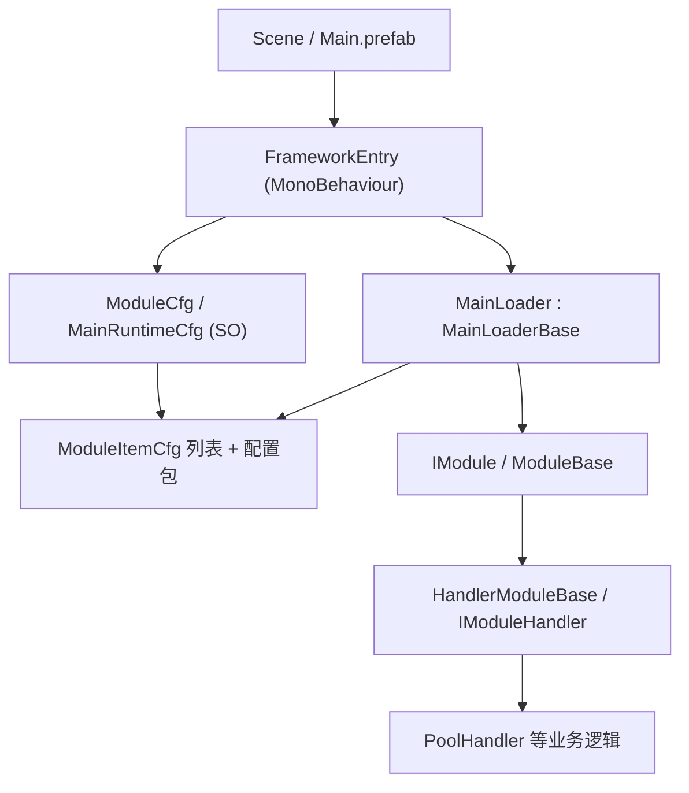

# Framework_WWJ 旧架构说明

本文记录清理前的真实实现，供新框架设计时比较。它是历史说明，不是兼容性承诺。

## 1. 总体结构



核心思想是：场景入口负责转发 Unity 生命周期，Loader 负责模块集合与执行顺序，Module 是框架门面，复杂业务可以下沉到纯 C# Handler。

## 2. 场景入口

`FrameworkEntry` 是场景中的 `MonoBehaviour`：

1. `Start` 注入配置和协程宿主；
2. 调用 `MainLoaderBase.Born()`；
3. 调用 `MainLoaderBase.Init(this)` 启动协程初始化；
4. 转发 `Update/FixedUpdate/LateUpdate`；
5. `OnDestroy` 调用 `UnInit()` 和 `Die()`。

旧入口只有一份 `ModuleCfg`，没有清晰的“全局模块配置 + 场景模块配置”合并语义。

## 3. 模块契约与生命周期

`IModule` 同时承担状态、加载、运行和帧循环契约：

```text
Born
  -> BeginInit -> Init -> EndInit
  -> Run/Pause
  -> UpdateHandle / FixedUpdateHandle / LateUpdateHandle
  -> BeginUnInit -> UnInit -> EndUnInit
  -> Die
```

`ModuleBase` 是普通 C# 对象，不是 `UnityEngine.Object` 或 `ScriptableObject`。它维护：

- `isLoading`
- `currentInitState`（Sleep / Loading / Success）
- `isRunning`
- `autoRun`

具体模块通过一组拼写为 `OnVaildXxx` 的虚方法接入生命周期。

### Handler 模式

`HandlerModuleBase<T>` 继承 `ModuleBase`：

- `T` 必须实现 `IModuleHandler`；
- 可由 Odin 序列化 `handler`，也可通过 `handleType` + `Activator.CreateInstance` 反射创建；
- Handler 通过 `handler.module` 反向引用模块；
- Module 把生命周期和公开 API 转发给 Handler；
- 只有实现 `IModuleHandlerLateUpdateSupport` 的 Handler 才接收 LateUpdate。

这套“门面 + 业务处理器”分层值得参考，但旧实现把生命周期、序列化、反射创建和状态管理绑得较紧。

## 4. Loader

`MainLoaderBase` 是 `MonoBehaviour`，同时实现 `IMainLoader`、`IModuleHandler` 和 `IMainLoading`。主要职责：

- 从 `ModuleCfg.modules` 注册启用模块；
- 用 `moduleKey` 字典和顺序列表保存运行项；
- 按较小的 `initPriority` 优先初始化；
- 每个模块执行一帧一个的协程初始化；
- 逆序反初始化和销毁；
- 派发三种 Unity Tick；
- 提供 `AddModule/RemoveModule/GetModule/GetModules`；
- 提供框架级 `Pause/Run`；
- 暴露 Loading 事件、进度与当前模块名。

### 旧 Loader 的重要行为

- 重复 `moduleKey` 会移除旧模块，再注册新模块，不存在“全局配置优先”的语义。
- 运行时新增模块会在主初始化完成后单独启动初始化协程。
- 初始化异常被记录后继续处理后续模块，Loader 最终仍会把整体进度设为完成。
- `RemoveModule` 直接调用 `Die`，不会先执行完整反初始化链。
- 声明了异步状态提供接口，但 Loader 没有消费它；所谓异步模块初始化并未真正闭环。

## 5. 配置系统

`ModuleCfg : GeneralSO` 包含三层职责：

1. 模块列表；
2. 静态 `GeneralSO` 配置字典及其 Init/UnInit 回调；
3. 已注释掉实际加载逻辑的动态/热配置数据结构。

`MainRuntimeCfg` 再增加：

- 本地 `moduleItemCfgs`；
- 递归引用的 `mainRuntimeCfgPackages`；
- 包之间的模块与静态配置合并；
- Editor 下的重复 key、类型和实例检查；
- PlayMode/OnValidate 缓存失效逻辑。

问题在于配置对象同时承担模块组合、生命周期、缓存、包管理和未来热更占位，核心边界变得模糊。运行时 `modules` 递归没有循环引用保护，而编辑器重复检测有保护，两者行为并不一致。

## 6. 业务模块现状

### Audio

旧 `AudioModule` 只是生命周期日志样例，没有音频播放、通道、音量、资源或混音管理。它已在本次盘点前被删除。

### Pool

对象池是唯一完成度较高的模块：

- `PoolModule`：框架门面和静态 `Instance`；
- `PoolHandler`：多池字典、配置注册、分帧预热和自动缩减；
- `ObjectPool`：Unity `GameObject` 实例化、激活、父节点和回调缓存；
- `GeneralPool<T>`：纯 C# 空闲/在用集合；
- `ObjectPoolCfg`：SO 配置；
- `IObjectPoolSupport`：取出/归还回调。

可复用思想与风险详见 [旧对象池设计归档](./Legacy_Object_Pool_Design.md)。

### Resource

只有 `ResourceInfoBase`、`AssetInfo`、`CfgAssetInfo` 等路径描述类型，试图同时描述 AssetDatabase、AssetBundle、Resources 和 Addressables。不存在真正的加载器、缓存、句柄、引用计数或卸载策略。

## 7. Editor 与 Utils

`FrameworkToolAppWindow` 提供 SO Creator 和 Pool Manager，但它直接依赖具体 Pool 类型；新增模块会继续扩大这个中心窗口。脚本使用 `UnityEditor`，却不在标准 `Editor` 目录或独立 Editor asmdef 中，播放器构建隔离不清晰。

`Utils` 包含：

- 约 60 个 `List<T>` 扩展，职责从安全访问、集合运算一直延伸到随机权重生成；
- `Dictionary` 的安全访问/合并扩展；
- 用字典索引 + key/value 双列表实现的 `FastDictionary`。

这些工具可作为算法参考，但不应在新核心建立前整包迁回。新代码只应在出现真实重复需求时引入小而有测试的工具。

## 8. 旧架构的主要问题

- 核心生命周期过多，状态转换与业务初始化混在一起。
- Loader 同时是 MonoBehaviour、根管理器、Handler、Loading 服务和运行时模块注册表。
- 配置系统包含过多尚未落地的高级能力。
- 模块不是 SO，但依赖 Odin 在 SO 配置内序列化接口对象，Inspector 行为不够直观。
- 全局模块与场景模块没有一等模型。
- Editor/Runtime 没有程序集隔离。
- 大量功能只有日志或文档，缺乏自动测试与 PlayMode 验收记录。
- 参考框架的概念仍然主导命名和边界，尚未围绕本项目的实际游戏目标收敛。

这些问题解释了为什么本次选择先归档、再从空白核心重新设计，而不是继续在旧 Loader 上叠加修补。

