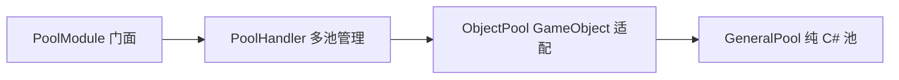

# 旧对象池设计归档

> 来源：2026-03-25 的对象池实现、源码注释和原技术文档。  
> 状态：历史参考，未经完整测试，不应直接复制回新框架。

## 1. 旧分层

- `PoolModule` 接入模块生命周期并提供静态 `Instance`。
- `PoolHandler` 维护池字典、分帧预热任务和闲置缩减计时。
- `ObjectPool` 负责 Instantiate、SetActive、父节点和 Unity 组件回调。
- `GeneralPool<T>` 用空闲列表、在用列表与 swap-remove 管理对象。
- `ObjectPoolCfg` 用 SO 配置池名、模板、预热数量、扩容步长和缩减时间。

## 2. 值得保留的思想

- 纯 C# 池与 Unity GameObject 适配分层。
- 构造时注入 create/take/back/destroy 回调。
- 空闲列表尾部取出，避免移动元素。
- 在用列表用 swap-remove 实现常数级删除。
- 可选 `IPoolIndexable` 让对象自带在用索引。
- 缓存 `IObjectPoolSupport[]`，避免每次 Spawn/Despawn 扫组件。
- 分帧预热，避免启动时集中 Instantiate。
- 配置驱动常用池的建立。

## 3. 旧实现中必须修正的问题

- `GeneralPool.TakeBackItem` 在确认对象属于在用集合之前，就执行归还回调并加入空闲列表；重复归还或归还外来对象会污染池。
- `Clear/Dispose` 只销毁空闲对象，不处理仍在用对象；API 名称容易让调用者误判。
- `ObjectPool.Clear` 不销毁每个池创建的父节点，可能留下空 Hierarchy 节点。
- `ObjectPool` 为每个池调用 `DontDestroyOnLoad`，全局/场景池所有权不清晰。
- 自动缩减计时到 0 后没有重置，之后可能每个 FixedUpdate 都尝试缩减。
- 池重新变为忙碌时，闲置计时没有恢复到配置值。
- 注销池时没有清理对应的分帧预热任务。
- 池名、模板归属、重复注册和错误处理只靠字符串与日志。
- 文档声称“高性能、零 GC”等，但没有基准测试、Profiler 记录或自动测试支撑。
- 旧测试 Cube Prefab 已被删除，配置资产存在失效引用。

## 4. 新实现前的测试契约

如果对象池成为新框架的基础模块，至少先覆盖：

- 预热数量正确；
- 空池自动扩容；
- 取出/归还回调顺序；
- 重复归还、外来对象归还的拒绝策略；
- TakeBackAll；
- 缩容不低于保留量；
- Clear/Dispose 对空闲与在用对象的精确定义；
- GameObject 父节点与场景切换所有权；
- 分帧预热取消；
- Domain Reload 与退出 PlayMode 后没有残留对象。

新实现可以复用算法思想，但应重新定义所有权和错误语义，而不是直接恢复旧文件。

