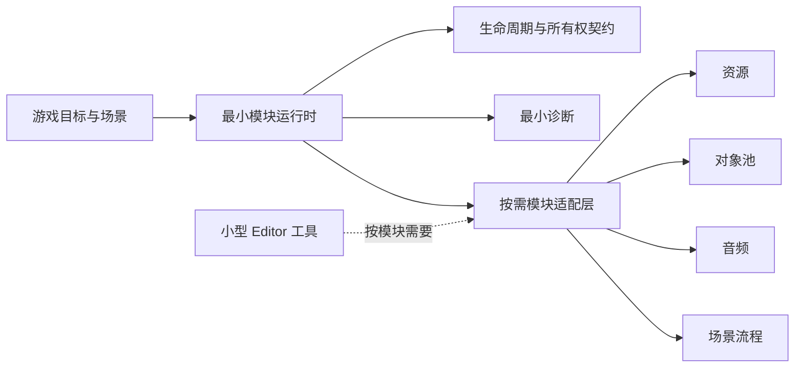

# HTY 轻量化提炼矩阵

> 状态：候选分析，不是 FrameWork_Ranger 最终架构。 
> 依据：[HTY / ActFramework 参考架构](./06_HTY_Reference_Architecture.md)。

## 1. 使用方式

本文只回答“HTY 中哪些问题与机制值得继续研究”。每项结论必须在具体阶段结合用户需求、游戏目标和验收标准重新确认。

| 标记 | 含义 |
| --- | --- |
| 保留思想 | 问题真实且机制具有普遍价值，但 API 仍需重新设计 |
| 简化验证 | 可能进入早期骨架，但先实现最小语义 |
| 延后 | 不进入基础骨架，出现真实需求后再设计 |
| 明确舍弃 | 不作为新框架目标，除非用户重新提出需求 |

## 2. 保留思想

| HTY 机制 | 解决的问题 | FrameWork_Ranger 候选方向 | 状态 |
| --- | --- | --- | --- |
| 宿主统一装配与驱动模块 | 避免每个系统自行争夺 Unity 生命周期 | 由单一运行时明确创建、持有、驱动和销毁模块 | 候选 |
| 确定性初始化与反序卸载 | 保护模块依赖顺序 | 保留可验证顺序；排序依据和依赖声明方式待定 | 候选 |
| 全局与场景生命周期区分 | 表达跨场景服务和场景服务 | 先由游戏目标确认是否确实存在两种作用域 | 候选 |
| 可选 Tick 能力 | 避免所有模块接收全部帧回调 | 倾向显式 opt-in，不预设接口形态 | 候选 |
| 配置驱动的模块组合 | 允许不同场景/游戏组合模块 | 配置只描述什么，运行时如何实例化，仍需分开决策 | 候选 |
| 模块门面与逻辑实现解耦 | 兼顾 Unity 序列化入口与可测试逻辑 | Handler 作为复杂模块的可选组合，不强制普及 | 候选 |

## 3. 简化后再验证

| HTY 机制 | 当前复杂度 | 最小验证方向 | 不提前决定的内容 |
| --- | --- | --- | --- |
| 九段生命周期 | Born、Init 前后段、UnInit 前后段、Die 与运行状态交织 | 从真实异步/回滚需求反推最少状态 | 具体方法名、同步或异步、取消模型 |
| External / Internal 双模块体系 | SO 与 MonoBehaviour 各有基类、实例化和生命周期分支 | 先比较普通 C#、SO、MonoBehaviour、组合方案 | 模块必须是 SO |
| 递归配置包 | 来源合并、缓存失效和覆盖规则复杂 | 初期最多验证一层显式组合 | 递归、覆盖优先级、热配置 |
| Loading 进度 | 模块可报告加载状态并驱动 UI | 只有首个游戏目标需要时才进入核心契约 | 统一进度算法、加载 UI |
| key/type 多索引查询 | 查找方便但注册和重复规则复杂 | 先选一个主要访问模型 | 字符串 key、Service Locator、静态单例 |
| 动态 Add/Remove | 支持运行时热插拔 | 基础骨架先验证静态模块集合 | 热插拔时的依赖、回滚和并发语义 |
| Pause/Run | 支持模块级运行控制 | 区分游戏暂停、模块禁用和宿主停止 | 是否属于所有模块的基础接口 |

## 4. 延后到真实需求出现

- Agent 的碰撞、触发器和实体回调分发。
- 热配置、动态配置生命周期与配置回调。
- Odin 单例唤醒项和多种懒加载单例。
- 统一加载 UI、复杂场景加载进度和 Addressables 场景扩展。
- FunctionInjection、运行时逻辑替换和热插拔工具。
- RuntimeEditorSupportPlus、FrameworkCenter 和大型编辑器工作台。
- 网络、Lua、战斗、AI、状态效果、世界流送等 RuntimeModule。
- 大型通用 Util 集合；工具只随已确认模块按需加入。

## 5. 默认舍弃

| 项目 | 舍弃原因 |
| --- | --- |
| 对 HTY 公共 API 的兼容 | 本次是从零设计，不承担迁移大型既有项目的成本 |
| 单一聚合程序集引用全部模块 | 破坏可选模块边界，放大编译与依赖成本 |
| 核心直接依赖全部第三方库 | Odin、DOTween、Addressables 等应由具体需求或适配层引入 |
| 多种语义不同的单例并存 | 所有权和销毁时机不清晰，容易形成隐式依赖 |
| 巨型静态 Global 工具入口 | 把生命周期、资源和业务访问混为全局状态 |
| 为“未来可能需要”预留空实现 | 会让核心契约在没有测试场景时提前膨胀 |

“默认舍弃”不是永久禁止；重新引入必须有明确用户需求、替代方案比较和验收测试。

## 6. 轻量框架边界候选

图中模块名称只是常见候选，不代表实现顺序或首批清单。

## 7. 每项候选的通过条件

某个 HTY 机制只有同时满足以下条件，才可以进入 FrameWork_Ranger 的阶段设计：

1. 能指出它服务的具体游戏行为或开发工作流；
2. 能描述不实现时会出现的实际问题；
3. 有比 HTY 原实现更小的可验证方案；
4. 明确创建者、持有者、销毁者和失败行为；
5. 有 EditMode、PlayMode 或垂直切片验收场景；
6. 记录为架构决策，而不是只存在于聊天或代码注释中。

待决策项目统一收录在 [重建设计待办](../../00_Project/09_Rebuild_Decision_Backlog.md)。
