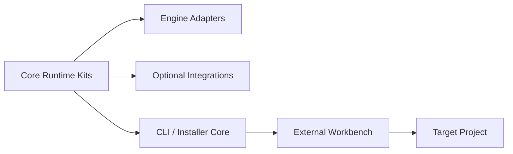

# YokiFrame Kit 架构与源码索引

> 参考项目：`D:\unityhub\UnityProjects\YokiFrame`  
> 检查日期：2026-08-19  
> 默认权限：只读  
> 用途：补充 FrameWork_Ranger 在可选模块、所有权、资源适配与工具链方面的设计证据；不要求兼容或复制 YokiFrame API。

## 1. 信息标记

- **事实**：已从 YokiFrame 的源码、项目文档或项目 Skill 中确认。
- **推断**：根据多处实现归纳的意图，仍可继续验证。
- **候选**：值得 FrameWork_Ranger 讨论的方向，尚未成为决策。
- **已确认方向**：用户明确提出，但具体接口仍需在单模块阶段设计中敲定。

## 2. 项目定位

**事实：** YokiFrame 以独立 Kit 组织功能，核心目录区分 `Runtime`、Unity `Adapters`、可选 `Integrations`、工具与 `Workbench`。当前包标识为 `com.hinatayoki.yokiframe`，参考快照版本为 `2.0.0-preview`。

**事实：** Kit 的运行时完成、编辑器交互和 Workbench 支持是不同层次；一个 Kit 可以只提供 Runtime，不必为了统一外观而强制附带大型编辑器系统。

这与 FrameWork_Ranger 的目标相似之处，是把能力拆成可按需组合的单元；不同之处是 FrameWork_Ranger 当前先以 Unity 内的 Module SO 和统一 Scope 生命周期为主，不直接采用 YokiFrame 的静态 Kit API。

## 3. 三个基础 Kit 的事实

### 3.1 EventKit

- **事实：** `EventKit` 提供 Type、Enum 和兼容 String 三种事件总线；新代码优先 Type 或 Enum。
- **事实：** 注册返回可注销令牌，令牌持有具体监听节点；调用方承担在自身生命周期结束时注销的责任。
- **事实：** EventKit 的公共运行时接口没有依赖 PoolKit。其内部事件容器会复用链表节点，但这是实现细节，不等于模块间公共依赖。
- **事实：** 当前语义是同线程同步派发，不承担跨线程队列、请求/响应或持久化消息职责。

### 3.2 PoolKit

- **事实：** PoolKit 的 `ObjectPool<T>` 面向普通 C# 引用类型，不等同于 Unity GameObject 池。
- **事实：** 可创建调用方独占的局部池，也可注册到共享池表；局部池和共享池都要求明确释放。
- **事实：** `PoolOptions` 明确预热数量和最大保留数量；`IPoolable` 或显式委托定义借出/归还行为。
- **事实：** 共享注册表按具体类型唯一，清理时继续释放其他池并聚合异常。

### 3.3 ResKit

- **事实：** ResKit 用 `IResourceProvider` 隔离资源门面与引擎/后端实现。
- **事实：** 每次获取返回独立 `ResHandle<T>`，Handle 拥有一次引用的释放权；底层同一资源可共享缓存与引用计数。
- **事实：** 同路径同类型的并发异步加载会合并底层工作；单个等待者取消不必然取消其他等待者。
- **事实：** Provider 替换会推进代次，并清理旧缓存与在途状态；Unity Resources 与 YooAsset 分别位于适配层和可选集成层。

## 4. 对 FrameWork_Ranger 的启示

| 主题 | 参考事实 | FrameWork_Ranger 候选方向 |
| --- | --- | --- |
| 可选能力 | Kit 可以独立存在 | 正式模块使用独立程序集和清晰依赖图，避免再次形成总聚合程序集 |
| 所有权 | Pool、Event Token、ResHandle 都把释放责任显式交给持有者 | 模块公开 API 必须同时定义获得、持有、释放和 Scope 卸载行为 |
| 资源后端 | 门面与 Provider 分离 | ResourceModule 可用 Handler 或 Provider 适配后端，但接口需由本项目需求重新设计 |
| 事件与池 | YokiFrame 没有公共硬依赖 | 用户希望 EventCenter 依赖引用池；应把依赖缩到最小能力接口，而不是默认依赖整个 GameObject 池 |
| 工具链 | Installer 先生成计划，再应用、验证和回滚 | 未来分发 App 应把扫描、计划、执行和验证分层，不直接复制文件后宣称成功 |

## 5. 关键源码路线

路径均相对于 `D:\unityhub\UnityProjects\YokiFrame`。

### 项目 Skill 与总览

1. `Core/Editor/Skills/yokiframe/SKILL.md`
2. `Core/Editor/Skills/yokiframe-cli/SKILL.md`
3. `Core/Editor/Skills/yokiframe-workbench/SKILL.md`
4. `Core/Editor/Skills/yokiframe/references/kit-index.md`
5. `Documentation~/Guides/AI-Install.md`
6. `Documentation~/Guides/Lifecycle-and-Ownership.md`

### EventKit

- `Core/Runtime/EventKit/Facade/EventKit.cs`
- `Core/Runtime/EventKit/Buses/TypeEvent.cs`
- `Core/Runtime/EventKit/Events/EasyEvent.cs`
- `Core/Runtime/EventKit/Lifetime/IUnRegister.cs`
- `Documentation~/API/EventKit.md`

### PoolKit

- `Core/Runtime/PoolKit/Pools/PoolKit.cs`
- `Core/Runtime/PoolKit/Pools/ObjectPool.cs`
- `Core/Runtime/PoolKit/Pools/SharedPoolRegistry.cs`
- `Core/Runtime/PoolKit/Contracts/PoolOptions.cs`
- `Documentation~/API/PoolKit.md`

### ResKit

- `Core/Runtime/ResKit/Contracts/IResourceProvider.cs`
- `Core/Runtime/ResKit/Handles/ResHandle.cs`
- `Core/Runtime/ResKit/Facade/ResKit.Provider.cs`
- `Core/Runtime/ResKit/Facade/ResKit.Loading.cs`
- `Core/Runtime/ResKit/Facade/ResKit.Async.cs`
- `Core/Runtime/ResKit/Facade/ResKit.Release.cs`
- `Core/Adapters/Unity/Runtime/ResKit/Resources/UnityResourceProvider.cs`
- `Core/Integrations/Unity/ResKit/YooAsset/`
- `Documentation~/API/ResKit.md`

### CLI、Installer 与 Workbench

- `YokiFrameWorkbench~/src/YokiFrame.Cli/`
- `YokiFrameWorkbench~/src/YokiFrame.Installer.Core/`
- `YokiFrameWorkbench~/src/YokiFrame.Tooling.Application/`
- `YokiFrameWorkbench~/src/YokiFrame.Workbench.Avalonia/`
- `YokiFrameWorkbench~/src/YokiFrame.Packaging/`

## 6. 阅读边界

- YokiFrame 只作为设计证据，不修改其源码、文档或 Skills。
- 不把静态 Kit 门面、命名、线程策略或引擎兼容目标直接搬进 FrameWork_Ranger。
- 形成正式模块计划时，应同时阅读 LyingBottle/HTY 的真实游戏用例与本项目核心契约，再由用户需求决定最小实现。
