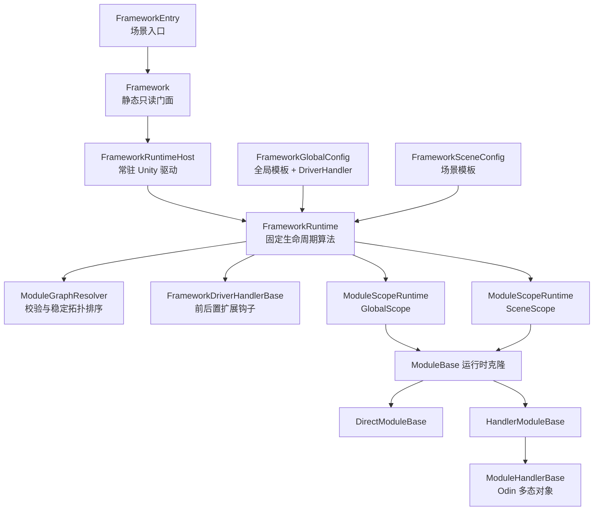

# Framework_WWJ 第一阶段：模块模型与驱动骨架

> 历史说明：本计划描述 Phase 1 完成时的显式 `FrameworkEntry` 启动模型。该入口已在 Phase 1.1 被中央项目设置、自动 Bootstrap 和 Scene Handle 所有权取代；模块生命周期等核心契约保持有效。当前设计见 [Phase 1.1 实施计划](../EditorCenter/00_Phase1_1_Implementation_Plan.md)。

> 状态：已实现并通过验收  
> 确认日期：2026-08-07  
> 阶段边界：只实现框架骨架、编辑器诊断、测试与最小示例，不实现资源、对象池、音频等正式业务模块。

最终结果见[第一阶段验收与复盘](./04_Phase1_Core_Skeleton_Acceptance_And_Review.md)，核心决策见 [ADR 目录](./ADR/README.md)。

## 1. 阶段结果

本阶段建立一个使用 Odin `SerializedScriptableObject` 作为配置模板、使用 UniTask 驱动异步生命周期的轻量模块框架。每个模块模板在所属作用域启动时克隆，运行状态只存在于克隆体，作用域结束后按真实加载顺序的逆序卸载并销毁克隆。

框架同时支持两种模块实现方式：

- `DirectModuleBase`：Module 直接实现生命周期和可选 Tick 接口。
- `HandlerModuleBase<THandler>`：Module 保持稳定的框架身份与公开门面，Odin 多态 Handler 承载可替换实现。

Framework 自身不伪装成 Module。固定算法由 `FrameworkRuntime` 持有，`FrameworkDriverHandlerBase` 只提供 Scope/Module 加载与卸载前后的异步扩展钩子，不得替换排序、回滚、状态机和所有权规则。

## 2. 已确认决策

| 主题 | 第一阶段决策 |
| --- | --- |
| 模块载体 | Odin ScriptableObject 模板，运行时统一克隆 |
| 运行状态 | 仅写入克隆、Handler、Scope 和 Runtime |
| 作用域 | 一个常驻 GlobalScope 与一个可替换 SceneScope |
| 场景入口 | 每个可运行场景显式放置 `FrameworkEntry` |
| 身份与重复 | 按具体 Module 类型精确识别；活动框架内同类型唯一 |
| 依赖 | 具体 Module 类型在代码中声明；Global 不得依赖 Scene |
| 排序 | 拓扑约束优先；同层按较小优先级、配置顺序、类型全名排序 |
| 生命周期 | UniTask 串行加载；加载可取消；卸载不可取消 |
| 失败 | 当前 Scope 终止并逆序回滚已成功加载模块 |
| Tick | Update/FixedUpdate/LateUpdate 显式能力接口；异常按目标隔离 |
| 访问 | 业务使用静态只读 `Framework`；模块内部使用 `ModuleContext` |
| 动态变更 | 不支持运行时 Add/Remove、Pause/Resume 或多 SceneScope |
| 诊断 | Runtime、Inspector、测试共用纯 `ModuleGraphResolver` |

## 3. 逻辑结构



## 4. 生命周期与所有权

1. `FrameworkEntry.Awake` 将 GlobalConfig、SceneConfig 和 Entry 实例 ID 提交给静态门面。
2. 首次启动先联合验证 Global+Scene；存在 Error 时不克隆任何对象。
3. Runtime 克隆 GlobalConfig，以取得独立 DriverHandler；随后创建并串行加载 Global 模块克隆。
4. Global 成功后创建并串行加载 Scene 模块克隆；全部成功后状态进入 `Ready`。
5. 新 Entry 和旧 Entry 的 Detach 进入同一主线程异步队列。新 Entry 加载前必须先完成旧 SceneScope 清理。
6. Entry 实例 ID 是 SceneScope 所有者令牌，迟到的旧 Detach 不得卸载新 Scope。
7. Scope 卸载先停止 Tick，再按成功加载记录逆序调用 Driver 钩子与 Module/Handler Unload，最后销毁全部克隆。
8. Scene 加载失败只回滚 SceneScope并保留 Global；Global 加载失败使 Runtime 进入 `Failed`，必须显式 Shutdown。
9. `Framework.ShutdownAsync` 先卸载 Scene，再卸载 Global，最后销毁 GlobalConfig 克隆和常驻 Host。

## 5. 公共契约

```csharp
public static class Framework
{
    public static FrameworkState State { get; }
    public static bool IsReady { get; }
    public static Exception LastException { get; }

    public static UniTask WhenReadyAsync(CancellationToken cancellationToken = default);
    public static T GetModule<T>() where T : ModuleBase;
    public static bool TryGetModule<T>(out T module) where T : ModuleBase;
    public static UniTask ShutdownAsync();
}
```

Module 依赖通过受保护只读类型列表声明。查找只按具体类型返回已经进入 `Loaded` 状态的实例。Scene 模块可以查询 Scene 与 Global 模块；Global 模块只能查询 Global 模块。

## 6. 目录与程序集

```text
Framework_WWJ/
├─ Runtime/                 Framework_WWJ.Runtime
│  ├─ Abstractions/         状态、作用域与 Tick 契约
│  ├─ Configuration/        Global/Scene 配置资产
│  ├─ Modules/              Module、Handler 与 Context
│  ├─ Graph/                校验、诊断与拓扑排序
│  ├─ Core/                 Facade、Entry、Runtime、Host、Driver
│  ├─ Scope/                Scope 所有权与运行记录
│  └─ Errors/               配置异常
├─ Editor/                  Framework_WWJ.Editor
├─ Tests/EditMode/          Framework_WWJ.Tests.EditMode
├─ Tests/PlayMode/          Framework_WWJ.Tests.PlayMode
└─ Samples/CoreSkeleton/    Framework_WWJ.Samples.CoreSkeleton
```

Runtime 只依赖 Unity、Odin Runtime 与 UniTask；Editor 和 Tests 单向依赖 Runtime。Runtime 不引用 `UnityEditor`。

## 7. 错误与边界

- 空配置、空模板、空 Handler、重复类型、非法/缺失/循环依赖均由共享 Resolver 诊断。
- Disabled 条目不参加装配，但保留在编辑器图中。
- Load 抛出的原始异常写入 `LastException` 并传给等待者；回滚异常只追加日志，不替换原始 Load 异常。
- Unload 的单点异常不会中止其他清理；显式 Shutdown 在清理完成后可抛聚合异常。
- Tick 异常只记录，不改变 Framework 状态或 `LastException`。
- 第一阶段不支持 Additive 多 SceneScope、模块热插拔、接口查找、日志抽象和自动配置修复。

## 8. 验收

- EditMode 证明依赖方向、稳定排序、重复/缺失/循环诊断、克隆隔离和 Module/Handler 状态。
- PlayMode 证明自动启动、Global→Scene 时序、场景替换、失败回滚、Tick 隔离和确定性 Shutdown。
- 两个最小示例场景使用相同 GlobalConfig、不同 SceneConfig 与不同 Handler 实现，场景切换后 Global 克隆 ID 保持一致。
- Unity 与 Rider 无编译错误；原始 SO 资产在运行前后不被污染；Inspector 与 Runtime 对同一配置给出相同诊断与顺序。

## 9. 实现规范

- public/protected API 使用中文 XML 注释。
- 排序、克隆、回滚、所有权和场景切换处写清楚“为什么”。
- 使用“Inspector 配置、运行时状态、公开属性、Unity 生命周期、框架生命周期、公开 API、内部实现”等有意义的 `#region`。
- 只验证外部配置、公共 API、状态迁移和 Unity 对象边界；不堆叠重复保护。
