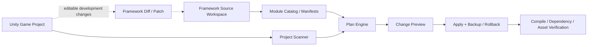

# FrameWork_Ranger 仓库、模块分发与管理 App 探索

> 日期：2026-08-19  
> 状态：研究议题与候选模型；不是已批准实现计划。

## 1. 问题定义

未来 FrameWork_Ranger 需要同时服务两种看似冲突的工作流：

1. 从框架仓库中按需选择 Core 和模块，并可靠引入不同 Unity 游戏项目；
2. 在使用框架制作游戏时，仍能修改框架源码、测试改动，并把通用改进安全地带回框架主仓库。

单纯复制 `Assets/Plugins/FrameWork_Ranger` 很容易失去版本、来源、模块依赖、GUID 和回流关系；单纯安装不可编辑 UPM 包又不适合边做游戏边维护框架。

## 2. 目标角色与核心用例

| 角色 | 需要完成的工作 |
| --- | --- |
| 框架维护者 | 管理 Core 与模块源码、版本、依赖、测试和发布 |
| 游戏项目开发者 | 查看可用模块、选择安装、升级、移除并验证项目 |
| 同时维护两端的开发者 | 在游戏上下文调试框架改动，区分项目特化与通用修改，并回流到源仓库 |
| AI / 自动化 | 读取机器可理解的模块目录，生成变更计划，执行后验证和报告冲突 |

## 3. 候选逻辑模型

### Source Workspace

框架源码的权威位置，包含 Core、各模块、测试、样例、文档和发布元数据。它不应被游戏项目里的任意副本静默取代。

### Module Catalog

未来可能记录稳定模块 ID、版本、直接依赖、Unity/包要求、程序集、资产边界、可选集成、验证入口与迁移说明。清单格式尚未决定，当前不创建伪稳定 schema。

### Target Projection

游戏项目中的框架呈现方式至少可能有三种：

- **发布安装：** 版本锁定、尽量不可变，适合普通项目使用；
- **本地开发链接：** 指向框架工作区，适合同时维护但要求工具和 Unity 对链接方式支持稳定；
- **可编辑快照：** 复制到项目并记录来源/基线，允许修改，再通过差异工具回流。

三种模式可以并存，但切换、冲突和 GUID 连续性必须有明确规则。

## 4. 从 YokiFrame 借鉴的工具链原则

**事实：** YokiFrame 将 CLI、Installer Core、应用层和 Avalonia Workbench 分离，并把目标项目诊断、安装计划和应用步骤区分开。

FrameWork_Ranger 的候选原则：

1. 先扫描并生成确定性计划，再修改目标项目；
2. 计划列出新增、更新、移除、冲突、依赖和验证动作；
3. Apply 保留可恢复信息，失败后可以回滚；
4. Verify 独立于 Apply，不能以“文件复制成功”代替 Unity 项目有效；
5. UI 只是应用层的一种入口，核心计划与安装逻辑应可被 CLI、测试和 AI 共同调用；
6. 发布安装与源码维护是不同工作流，避免在同一按钮中隐式完成 Git 操作和项目覆盖。

这些是候选原则，不代表采用 YokiFrame 的协议、代码或 Avalonia 技术栈。

## 5. 必须解决的 Unity 特有问题

- `.meta` / GUID 在安装、升级、移除和回流中的连续性；
- asmdef 与 Define Constraints 的模块依赖；
- UPM、Assets 内嵌源码、本地路径包和 Git 包的差异；
- Resources、Settings 资产、示例场景和用户配置的归属；
- 对用户已修改源码/资产的冲突检测，禁止静默覆盖；
- Packages、ProjectSettings 和第三方包变更的明确预览；
- Unity 版本、Odin、UniTask 与可选资源后端的兼容矩阵；
- Domain Reload、编译和自动测试的验证成本；
- 模块移除后序列化引用与中央配置条目的清理策略。

## 6. 决策待办

### 仓库与版本

- Core 与模块使用单一仓库、多个包，还是多个仓库？
- 模块独立版本还是全框架统一版本？
- 版本之间如何表达 Core/模块兼容区间？

### 安装形态

- 默认使用 UPM 包、Assets 垂直胶囊，还是由工具生成投影？
- 游戏项目需要编辑框架时，采用本地包、Git worktree、junction/symlink 还是可编辑快照？
- 如何可靠检测用户改过的文件并阻止覆盖？

### 模块清单

- 稳定模块 ID、依赖、可选依赖、程序集、资产、配置迁移需要哪些字段？
- 清单由人工维护、构建生成还是两者结合？
- AI 创建模块时如何同步清单且不制造虚假兼容声明？

### 反向维护

- 游戏项目中的框架修改如何分类为通用修复、项目适配或临时试验？
- 如何生成最小 patch/分支并在框架源仓库跑完整测试？
- 业务代码、配置资产和秘密信息如何保证不被带回框架仓库？

### App 边界

- 第一版是 CLI 优先、Unity Editor 扩展，还是桌面 App？
- App 是否负责 Git 操作，还是只生成操作计划并调用外部 Git？
- 离线、远程仓库、认证和发布渠道是否属于第一版？

## 7. 候选后续阶段

这些阶段只有在用户提供参考 App 并确认需求后才会正式规划：

1. **参考研究与用户旅程：** 梳理目标 App 交互和真实维护流程；
2. **领域模型与 ADR：** 确定源仓库、模块身份、目标投影和版本/依赖；
3. **只读 Scanner + Planner：** 先能可靠说明“会改什么”；
4. **CLI Apply / Verify / Rollback：** 无 UI 地验证核心流程；
5. **管理 App：** 在稳定应用层之上提供模块浏览、计划预览和状态展示；
6. **双向维护试验：** 在一个真实游戏项目验证框架修改回流。

## 8. 当前明确非目标

- 本轮不写桌面 App、CLI、安装器或模块清单解析器。
- 不移动 FrameWork_Ranger 目录，不拆 UPM 包，不改变 Git 分支或远程仓库。
- 不修改 LyingBottle、YokiFrame 或任何其他游戏项目。
- 不让未来分发问题阻塞三个基础模块的需求讨论；只要求新模块保持清晰边界并记录依赖。
