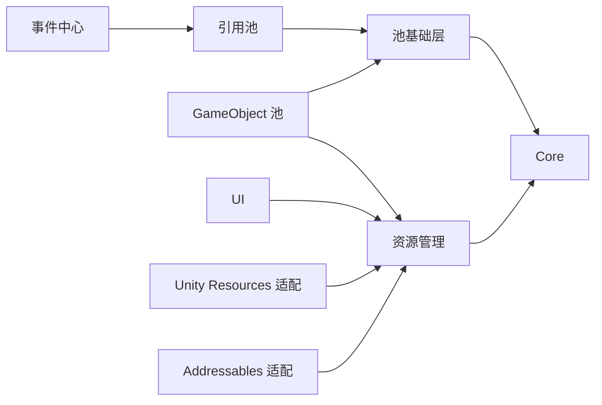

# 模块拆分、版本与开发回流设计

> 日期：2026-09-11。依赖表来自当前代码；模块 ID、分发边界、清单字段和同步规则为设计草案。尚未创建正式模块协议或移动源码。

## 1. 当前可验证的基础

项目根为 `FrameWork_WWJ/`，框架身份为 `FrameWork_Ranger`，源码在 `Assets/Plugins/FrameWork_Ranger/`。`ProjectSettings/ProjectVersion.txt` 为 Unity `6000.5.9f1`。项目清单包含 UniTask `2.5.11`、Addressables `2.9.1`、UGUI `2.5.0`、Input System `1.20.0`。这是当前工程取值，不是所有模块的最低兼容版本。

以下缩写均指 `FrameWork_Ranger` 下相应 Runtime 程序集；省略 Tests/Samples 的测试关系。

| 当前源码区域 | 直接 Runtime 依赖（asmdef） | 候选分发单元 |
| --- | --- | --- |
| `Runtime/` | UniTask | `ranger.core` |
| `BaseModules/ResourceManagement/Runtime/` | Core、UniTask | `ranger.resource` |
| `ResourceManagement/Integrations/UnityResources/Runtime/` | Core、Resource、UniTask | `ranger.resource.unity-resources` |
| `ResourceManagement/Integrations/Addressables/Runtime/` | Core、Resource、Addressables、ResourceManager、UniTask、UniTask.Addressables | `ranger.resource.addressables` |
| `BaseModules/Pooling/Core/Runtime/` | Core | `ranger.pooling.core` |
| `BaseModules/Pooling/Reference/Runtime/` | Core、Pooling Core、UniTask | `ranger.pooling.reference` |
| `BaseModules/Pooling/GameObject/Runtime/` | Core、Pooling Core、Resource、UniTask | `ranger.pooling.gameobject` |
| `BaseModules/EventCenter/Runtime/` | Core、Reference Pool、UniTask | `ranger.event-center` |
| `BaseModules/UI/Runtime/` | Core、Resource、UniTask、UGUI、TextMeshPro | `ranger.ui` |

这些是逻辑 ID 草案，不是已经存在的 UPM 包名。编辑器、样例和文档可作为模块组成部分或选择项，不必一项一个仓库。

图只展示主要框架依赖；完整编译条件还包含上表第三方程序集与下文 Editor 关系。运行时选择资源后端也必须满足实际配置，安装了资源门面不等于已有可工作的后端。

### asmdef 以外的依赖

Core 配置、模块 Handler 及 UI 源码直接使用 `Sirenix.OdinInspector` / `Sirenix.Serialization`。仅解析 asmdef 的 references 会漏掉自动引用的预编译 DLL。扫描器应同时记录显式程序集引用、预编译插件和已知外部类型来源；初版允许人工补充模块声明，不能声称静态分析能自动找全反射/序列化依赖。

Odin 当前是实际依赖，不能在安装计划中装作可选。正式分发只声明所需能力并检查使用者环境，不把 `Assets/Plugins/Sirenix` 随框架模块复制进发行物。后续若希望降低该依赖，应另开框架整改任务。

## 2. 真正拆分前的整改清单

| 事实与证据路径 | 对按需安装的影响 | 建议整改 |
| --- | --- | --- |
| `ResourceManagement/Editor/*.asmdef` 引用两个适配层及 Addressables Editor | 不装 Addressables 也会遇到 Editor 编译依赖 | 分离通用编辑器与后端专属编辑器 |
| `Pooling/Editor/*.asmdef` 引用 Core/Reference/GameObject/Resource | 引用池单独安装仍被编辑器拉入 GameObject 池 | 将共享页与各池页面拆出可独立引用的程序集 |
| `UI/Editor/*.asmdef` 引用 UI Samples、UnityResources、InputSystem | 无样例或无对应依赖组合不能直接成立 | 将样例生成器及其依赖移到样例编辑器边界 |
| Core Editor 的 `FrameworkSourceScriptIndex` 写死 Assets 搜索根 | UPM 模式源码导航可能失效 | 迁包时改为模块清单/包路径解析，先维持 Assets 路径 |
| `FrameworkProjectSettingsAssetUtility.FixedAssetPath` 写死插件下 Resources | 配置与发布文件范围重叠 | 单独标注项目资产，后续再讨论迁出路径 |
| 多个 SampleAssetBuilder 固定插件与配置路径 | 无样例安装和包只读路径不兼容 | 首版排除样例生成器；需要样例时使用独立交付范围 |

不要只删 asmdef 引用：其 C# 类型使用、编辑器注册和配置加载也要一并检查。模块独立安装必须在临时 Unity 工程编译验证；当前工程能编译不证明裁剪后能编译。

## 3. 分发方式比较与建议

| 方式 | 游戏内修改 | 版本/来源 | 主要成本 |
| --- | --- | --- | --- |
| 整目录手工复制 | 直接可改 | 无自动基线 | 无可靠升级与回流，不能满足目标 |
| App 管理的 Assets 副本 | 直接可改 | App 清单、精确来源、安装基线 | App 需负责文件归属、合并和恢复 |
| UPM Git 发布包 | 不应编辑缓存作为维护方式 | 项目清单和包锁 | 包边界整改、Git 依赖闭包、开发模式切换 |
| UPM 本地目录包 | 直接编辑外部工作区 | App 管理工作区来源 | 机器路径、可移植性、多个项目共享改动 |
| Embedded package | 项目内可编辑并提交 | 需另记回流基线 | 包路径迁移、与原 Git 来源关联 |

**建议首版选择清单驱动的 Assets 副本。** 发布物从确定的源提交生成，按白名单投影到现有目录，不用整插件复制。这样可先验证用户最关心的游戏开发回流。后续再提供 UPM 安装/开发模式。Unity 对本地包与内嵌包的支持见[本地路径](https://docs.unity3d.com/6000.0/Documentation/Manual/upm-localpath.html)、[Embedded packages](https://docs.unity3d.com/6000.0/Documentation/Manual/upm-embed.html)。

同一模块不能同时存在 Assets 与 Packages 两份可导入副本。迁移必须连同资产 `.meta` 进行，保持 GUID 并验证引用；不要重新生成 GUID 来“解决重复”。Unity 依靠元数据维持资产身份，依据：[Asset metadata](https://docs.unity3d.com/6000.0/Documentation/Manual/AssetMetadata.html)。

## 4. 清单与版本模型（概念草案）

不在本轮锁定 JSON Schema，先约定必须表达的信息：

| 记录 | 必需信息 | 所属位置建议 |
| --- | --- | --- |
| 模块定义 | 稳定 ID、显示名、职责、源码路径、包含/排除规则、依赖、外部条件、文档入口 | 框架源仓库 |
| 模块发布记录 | 模块版本、源提交、文件清单、实际测试组合、变更说明、迁移说明 | 框架仓库/发布目录 |
| 项目安装锁 | 模块 ID、精确版本、精确来源、投影路径、基线引用、直接选择还是自动依赖 | 游戏项目内可提交的 `.ranger/lock.json`（名称候选） |
| 本机映射 | 项目 ID 到本机路径、源工作区路径、Unity/Git 路径、界面偏好 | App 用户数据目录，不进入游戏仓库 |
| 操作记录 | 受影响文件、写前内容位置、步骤状态、验证结果 | 本机操作目录；不放在会被清理的 Unity Library 中作为唯一恢复来源 |

项目锁不能绑定另一个人的绝对路径。基线可以由不可变源提交加发布文件清单重建，并在本机缓存所需文件内容；有缓存时支持离线比较。基线丢失且来源取不回时进入“基线不可用”，不能猜测。

模块各自使用版本号，App 另有自己的版本。一个框架 Git 提交可对应多个模块发布记录，并不要求所有模块升同一个版本。建议使用模块标签，例如 `event-center/v0.1.0`（仅例子），安装时最终解析到精确提交/发行物。

兼容声明与锁定分开：模块声明支持哪些 Core/依赖版本，项目记录实际装了哪个。首版可从经过测试的精确依赖组合起步；未经验证不填写宽泛兼容范围。语义化版本描述变更契约，不证明跨模块组合可用，参考：[SemVer](https://semver.org/)。

如果后续使用 UPM，不能把 App 的版本范围表达式直接复制到 Unity `package.json`。Unity 包依赖使用具体版本语义，Git URL 依赖需由项目 manifest 处理，详见[技术参考](./06_Technology_And_References.md)。

## 5. 文件与配置归属

| 类别 | 安装/更新行为 | 回流行为 |
| --- | --- | --- |
| 框架源码、asmdef 及配套 `.meta` | 模块拥有，参与基线与差异 | 用户选择的通用修改可回流 |
| 框架文档与模块测试 | 依据交付选择，明确所属模块 | 可以回流，不默认带全部项目资料 |
| 项目级 Settings、GlobalConfig、场景绑定、模块配置实例 | 仅在明确初始化时生成；之后属于项目 | 默认排除，不复制游戏配置覆盖框架样例 |
| Samples | 显式选择；复制后的用户编辑资产需单独归属 | 不把用户修改的演示场景自动当作框架标准样例 |
| 游戏场景、Prefab、美术、业务脚本 | 不在框架同步范围 | 默认排除 |
| Sirenix 等外部插件 | 诊断依赖，不随框架白名单分发 | 不回流 |
| 父目录及其 `.meta` | 共用目录不能由多个模块任意覆盖/删除 | 共享所有权需要唯一来源，卸载最后一个使用者时再判断 |

当前 `Resources/FrameworkProjectSettings.asset` 和 `FrameworkGlobalConfig.asset` 先按项目配置处理，不能因它们位于插件目录就归入 Core 发布文件。新项目初始化应生成空白/最小配置，不能带入当前工程的场景与模块实例。项目自有新配置可拥有新 GUID；框架已有代码/公共资产 GUID 必须连续。

模块文件清单必须与其独立文件夹的 `.meta` 一起考虑。多个模块映射同一个文件、同 GUID 不同内容、未知资产占用目标路径，均应在计划阶段报告。

## 6. 三方比较与更新规则

对每个受管理文件，定义 **B = 项目安装来源的基线，L = 游戏项目当前内容，T = 目标模块版本内容**。不存在也作为状态，不能只比较两端现存文件。

| 状态 | 建议动作 |
| --- | --- |
| L = B，T 变化 | 应用目标变化（包括目标删除） |
| T = B，L 变化 | 保留本地修改 |
| L = T | 无需改文件 |
| L、T 均变化且不同 | 文本尝试三方合并；重叠或不支持的资产进入冲突 |
| B 不存在，两端新增不同内容 | 新增/新增冲突 |
| 一端删除，另一端相对 B 修改 | 删除/修改冲突 |
| 只有两端副本但无可信 B | 标为来源未知，先建立来源映射，不能当成普通覆盖 |

文本合并可以调用 Git；二进制不自动拼接。Unity YAML 即使无文本冲突也不代表语义正确；场景/Prefab 合并后仍需 Unity 验证，Smart Merge 作为后续可选适配。`.meta` 中的 GUID 分歧单独报告，不用通用文本合并随意改身份。

更新完成后，**新的上游基线指向 T 的原始发布内容**，项目内容可以是保留本地修改后的合并结果。不能把全部合并结果当成“已发布内容”，否则项目特化修改会从未来差异中消失。验证状态另行记录，文件安装完成不伪装成已通过测试。

## 7. 开发回流规则

1. 从 B 与 L 识别模块内变化，用户选择通用改动；项目特化与临时试验保持本地。
2. 在源仓库目标分支的独立工作区取得当前内容 S；用 B、所选项目变化、S 生成合并计划。未选改动不进入提交。
3. 新增/删除与脚本 `.meta` 成组展示。只暂存本次确认的框架路径，不执行全仓库 `git add .`。
4. 验证合并后的模块及真实受影响依赖，再展示提交文件、目标分支与说明。提交、推送、发布分别记录结果。
5. 回流到某个源码分支不等于游戏项目已升级到新发布版本。保持安装基线，另记回流提交关联；等项目安装相应发布版本时再更新基线。

存在其他未提交源码变更时优先使用独立工作区，避免混入当前编辑内容。多个游戏不默认链接到同一个可写工作区，否则一次调试可能影响所有游戏。Git worktree 支持同仓库多个工作目录，可作为隔离实现，参考：[git-worktree](https://git-scm.com/docs/git-worktree)。

## 8. 应用与恢复

流程为扫描 → 计划 → 写前复核 → 保存受影响文件的原内容 → 按步骤应用 → Unity 验证 → 写入准确安装/验证状态。

只复核和备份本次受影响文件及必要清单，不建立全工程环境快照。不能仅凭修改时间判断内容相同；可复用 Git 内容对象或直接内容比较，性能需求明确后再加有限缓存。

多文件写入不是一个文件系统原子事务。恢复依赖操作日志、原内容和已完成步骤：失败后仅撤回本次变更；如果用户在失败后又编辑文件，应先保留该内容并提示冲突，不能以恢复为名覆盖新编辑。跨目录、只读文件、磁盘不足与进程退出需通过小规模故障试验验证。

卸载先检查反向依赖和项目配置引用，只移除清单中仍由模块拥有且可安全移除的文件。动态引用无法全部静态发现，应如实提示验证范围，不能宣称“扫描没有引用就绝对安全”。
