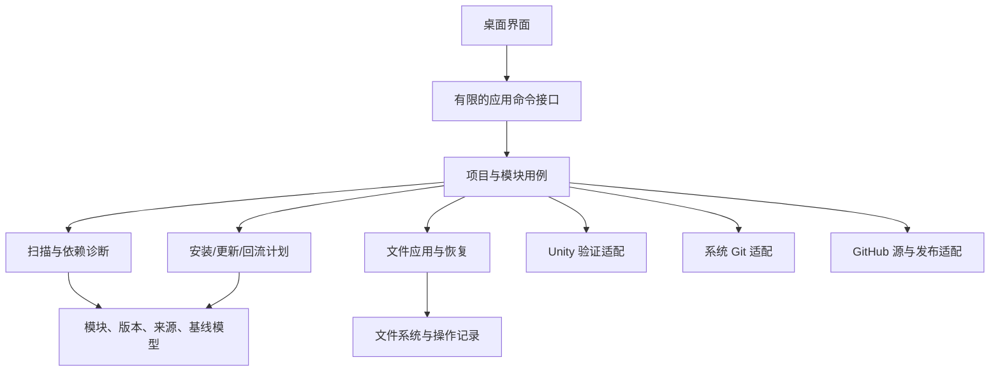

# App 技术路线与官方参考

> 核对日期：2026-09-11。选型是推荐，未定版。Unity 官方资料采用可访问的 6000.0 手册，目标工程为 6000.5.9f1；实际兼容仍需在目标版本验证。

## 1. 桌面技术比较

| 路线 | 对本项目的优势（评估） | 成本/限制（评估） | 建议 |
| --- | --- | --- | --- |
| Electron + React + TypeScript | 两个参考 App 提供可观察的功能分层；文件列表、差异工作区便于迭代；Node 可调用 Git/Unity | 需维护 TS/前端工具链和主进程边界；实际内存和包体需要测量 | 原型首选 |
| C# + Avalonia | 可与 Unity 开发共享语言经验；适合把核心同步逻辑写成独立 .NET 库 | 差异视图、桌面布局与发布需要单独投入；不能直接复用 UnityEngine 依赖的代码 | 若长期维护优先统一 C#，可转为首选 |
| C# + WPF | 与第三个参考程序的技术迹象一致；Windows 原生工具路线 | Windows 绑定更强；后续跨平台需要额外 UI 工作 | 仅在明确 Windows 长期限定时考虑 |
| Tauri + Web 前端 | 使用系统 WebView，适合希望减少随包浏览器体积的方案 | 增加 Rust/原生命令维护及系统 WebView 差异验证 | 非首版优先 |
| Unity Editor 工具 | 容易使用 AssetDatabase 和现有配置模型 | 无法独立于打开的 Unity 项目承担完整桌面管理体验 | 用作后续验证/协作适配层 |

官方能力依据：[Electron 进程模型](https://www.electronjs.org/docs/latest/tutorial/process-model)、[Avalonia 文档](https://docs.avaloniaui.net/docs/welcome)、[WPF 概述（仅 Windows）](https://learn.microsoft.com/en-us/dotnet/desktop/wpf/overview/)、[Tauri 概述](https://v2.tauri.app/start/)。上表维护成本和优先级是本任务推断，没有进行性能基准，也没有固定第三方库具体版本。

原型定版前只比较一条关键链路：选项目 → 模块列表 → 大文件差异 → 后台扫描进度 → Git 命令取消 → 打包运行。如果用户没有语言偏好，建议按 Electron/TS 推进；不为比较四套技术各建一个完整 App。

## 2. 候选应用分层

领域模型与计划器不引用 Electron、React 或 UnityEngine。Git、文件系统、远程源、Unity 通过窄接口接入，便于用临时目录验证。未来 CLI 可以复用用例；本轮不要求先做完整 CLI 平台。

Electron 实现时，Renderer 只处理 UI；Preload 逐项暴露 `scanProject`、`planInstall` 等命令，不暴露任意文件写入或任意 Shell。主进程校验输入与登记目录边界，扫描和大规模差异放后台任务。启用 context isolation、限制 Node 暴露及渲染进程权限。依据：[Context Isolation](https://www.electronjs.org/docs/latest/tutorial/context-isolation)、[Electron Security](https://www.electronjs.org/docs/latest/tutorial/security)。

调用 Git/Unity 使用程序路径和参数数组；取消、超时、退出码与输出分开处理，避免把项目路径拼入 shell。路径写操作拒绝越出登记根目录的 `..`、绝对路径载荷、目录链接跳转；这是安装器处理文件清单的直接需求。

## 3. Unity 包管理的关键限制

### Git 包不等于双向源码工作区

Unity Git 依赖从远端取得包供项目使用，不提供向该仓库回流的维护工作区；要编辑本地源代码，应使用本地包或嵌入包等明确模式。Git URL 可指定子目录和修订，但不能在包 `package.json` 中声明包间 Git URL 依赖，仅项目 `manifest.json` 支持该方式。依据：[Git dependencies](https://docs.unity3d.com/cn/6000.0/Manual/upm-git.html)。

对我们的影响：若使用多 Git 包，App 必须把自有依赖闭包解析为项目层的精确依赖；不能只写入 `ranger.event-center` 就假设 Unity 会沿 Git URL 自动找到引用池。使用 Registry 可以换一种依赖分发方式，但同时引入 Registry 运营与认证成本。

### App 清单与 UPM 包清单分开

Unity 包清单描述包身份、版本、依赖等，依赖版本不按 npm 的任意范围规则解释；不要将 App 自己的兼容区间直接输出为 UPM 依赖。项目现有包版本也不能被我们的示例工程清单整份覆盖。依据：[Package manifest](https://docs.unity3d.com/6000.0/Documentation/Manual/upm-manifestPkg.html)。

### 本地开发与内嵌模式

`file:` 路径可引用本地包目录；路径可移植性、机器映射和团队拉取流程需要 App 明确管理。本地工作区共享给多个游戏会共享实时修改，建议项目隔离。内嵌包把可编辑内容放入项目 Packages，仍需自己记录原始来源。依据：[Local folder paths](https://docs.unity3d.com/6000.0/Documentation/Manual/upm-localpath.html)、[Embedded packages](https://docs.unity3d.com/6000.0/Documentation/Manual/upm-embed.html)。

### 资产正确性

保留 `.meta` 及 GUID，避免在同一 Unity 项目中导入同 GUID 的两份模块。普通文本合并不等于 Unity 资产语义合并；可研究 UnityYAMLMerge，但场景与 Prefab 的实际加载验证不可省略。依据：[Asset metadata](https://docs.unity3d.com/6000.0/Documentation/Manual/AssetMetadata.html)、[Smart Merge](https://docs.unity3d.com/6000.0/Documentation/Manual/SmartMerge.html)。

## 4. Git、GitHub 与发布

- **Git**：首版复用系统 Git 和凭据机制，提供源码状态、隔离工作区、差异、提交、显式推送。GitHub API 不应被当作逐文件源码同步协议。
- **三方文本合并**：`git merge-file` 可作为基础能力；输入 base/local/target 由 App 的模块来源规则决定，Git 本身不会替 App 找到游戏副本的正确安装基线。依据：[git-merge-file](https://git-scm.com/docs/git-merge-file)。
- **隔离工作区**：Git worktree 能给同一仓库建立多个工作目录；App 需管理引用的生命周期和分支占用，不能把整个 worktree 元数据带入游戏仓库。依据：[git-worktree](https://git-scm.com/docs/git-worktree)。
- **认证**：优先系统 Git Credential Manager/SSH 已建立的连接，App 配置不保存明文访问令牌。Git 认证不自动等于 GitHub REST API 已授权；若接入私有 Release 下载，需要独立处理 API 认证。依据：[Git Credential Manager](https://github.com/git-ecosystem/git-credential-manager)。
- **模块发行物**：可由确定提交生成 ZIP/目录文件清单，使用模块标签与 GitHub Releases 分发。建议发布完资产再公开对应目录记录；失败重试不要生成两个同版本不同内容的发行物。GitHub 支持 Release 和资产相关 API，发布一致性是我们的设计职责。依据：[GitHub Releases API](https://docs.github.com/en/rest/releases/releases)。
- **App 更新**：与模块发布分开规划。首版先有可下载的安装包即可；自动更新、签名和多平台打包在确定分发范围后细化，不因参考使用 electron-updater 就照搬其配置。

## 5. 开发前应完成的五个小试验

| 试验 | 输入与操作 | 通过标准 |
| --- | --- | --- |
| S1 模块依赖裁剪 | 临时 Unity 工程，仅 Core/池基础层/引用池/事件中心及真实第三方前置依赖 | 编译通过，缺失依赖诊断准确，未带入 GameObject/UI |
| S2 基线与回流 | 临时文件树及本地 Git 测试仓库，包含修改/删除、双方新增、未知基线、脚本 `.meta` | 能明确判定保留/合并/冲突，生成的回流只含所选文件 |
| S3 应用与中断恢复 | 部分写入后终止测试进程，模拟只读文件和预览后修改 | 恢复不丢文件、不覆盖后续编辑、锁状态与实际文件一致 |
| S4 首发桌面技术 | 项目选择、模块列表、大差异预览、后台任务和安装包 | 正常启动并操作；记录实际响应与内存，而非预设指标已通过 |
| S5 UPM 可行性（后续） | 拆好的测试包、Git 依赖闭包、本地路径、Assets/Packages 迁移 | 6000.5.9f1 下依赖解析和 GUID 引用正确，再承诺正式支持 |

S1–S4 支撑首版；S5 不阻塞 Assets 首版。上述试验是下一阶段待执行项。本轮仅做静态代码/文档研究，没有运行 Unity 编译，也没有调用参考 App 的同步功能。

## 6. 参考资料索引

| 官方资料 | 后续查阅目的 |
| --- | --- |
| [Unity Git dependencies](https://docs.unity3d.com/cn/6000.0/Manual/upm-git.html) | 子目录修订、项目 Git 依赖和认证限制 |
| [Unity Package manifest](https://docs.unity3d.com/6000.0/Documentation/Manual/upm-manifestPkg.html) | 包字段、版本和依赖 |
| [Unity Local paths](https://docs.unity3d.com/6000.0/Documentation/Manual/upm-localpath.html) | 本地源码开发模式 |
| [Unity Embedded packages](https://docs.unity3d.com/6000.0/Documentation/Manual/upm-embed.html) | 项目内嵌可编辑包 |
| [Unity Asset metadata](https://docs.unity3d.com/6000.0/Documentation/Manual/AssetMetadata.html) | `.meta`、GUID 与迁移 |
| [Unity Smart Merge](https://docs.unity3d.com/6000.0/Documentation/Manual/SmartMerge.html) | 序列化资产合并 |
| [Electron Process Model](https://www.electronjs.org/docs/latest/tutorial/process-model) | UI 与后台任务分层 |
| [Electron Context Isolation](https://www.electronjs.org/docs/latest/tutorial/context-isolation) | Preload 与有限 IPC API |
| [Electron Security](https://www.electronjs.org/docs/latest/tutorial/security) | 桌面能力边界 |
| [Avalonia](https://docs.avaloniaui.net/docs/welcome) / [Tauri](https://v2.tauri.app/start/) | 替代桌面路线 |
| [Git worktree](https://git-scm.com/docs/git-worktree) / [merge-file](https://git-scm.com/docs/git-merge-file) | 源码隔离与文本合并 |
| [Git Credential Manager](https://github.com/git-ecosystem/git-credential-manager) | 系统 Git 认证 |
| [GitHub Releases](https://docs.github.com/en/rest/releases/releases) | 模块发行物和 App 安装包 |
| [SemVer](https://semver.org/) | 各模块公开契约与独立版本 |

资料核对不代表实现验证；后续建立项目时再核对所选依赖的稳定版本，并通过锁文件固定实际构建组合。
