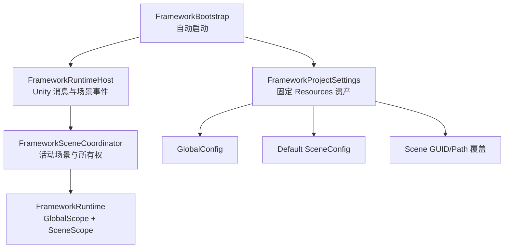

# Framework_WWJ Phase 1.1：中央启动、统一编辑器中心与架构类图

> 状态：已批准，实施中  
> 日期：2026-08-07  
> 前置阶段：[第一阶段骨架验收](../Core/04_Phase1_Core_Skeleton_Acceptance_And_Review.md)

## 1. 阶段目标

- 使用固定 `Resources/FrameworkProjectSettings.asset` 统一配置 GlobalConfig、默认 SceneConfig 与场景覆盖关系。
- 删除 `FrameworkEntry`，在首个场景加载后自动创建 Host，并按照活动场景切换唯一 SceneScope。
- 建立 `Framework_WWJ/Framework Center`，提供首页、配置、架构图、帮助与示例验收页面。
- 使用声明式 Attribute 绘制 Runtime/Editor 类与关键接口的分层节点图，并支持定位和打开源码。

不改变现有模块生命周期、依赖拓扑排序、串行加载、逆序卸载和失败回滚规则；不实现正式业务模块。

## 2. 中央启动结构

运行规则：

1. `SubsystemRegistration` 清理静态状态。
2. `AfterSceneLoad` 加载固定设置、创建 Host 并提交首个活动场景。
3. 场景配置按“路径精确覆盖、默认配置、空 SceneScope”解析。
4. ProjectSettings 与 Global/Scene 模块图全部通过后才创建克隆。
5. 活动场景变化和场景卸载进入现有串行操作队列；Scene Handle 作为所有者令牌。
6. Additive 场景只有在成为活动场景后才替换 SceneScope。

## 3. 主要脚本

### Runtime/Configuration

- `FrameworkProjectSettings`：Odin SO；保存 GlobalConfig、可空默认 SceneConfig、只读场景绑定列表。
- `FrameworkSceneBinding`：保存场景 GUID、缓存路径与非空覆盖 SceneConfig。
- `FrameworkProjectSettingsResolver`：纯算法校验并解析活动场景配置。
- `FrameworkProjectSettingsDiagnostic`：提供中文错误代码、严重程度与定位消息。

### Runtime/Core

- `FrameworkBootstrap`：静态重置、固定资产加载和首次自动启动。
- `FrameworkSceneDescriptor`：隔离 Unity Scene 与运行算法的场景身份值。
- `FrameworkSceneCoordinator`：订阅场景事件、维护场景取消源并提交 Attach/Detach。
- `Framework`、`FrameworkRuntimeHost`、`FrameworkRuntime`：改为场景所有权入口；公开只读门面保持不变。

### Editor/FrameworkCenter

- `FrameworkCenterWindow`：OdinEditorWindow 页面宿主。
- `FrameworkCenterPage`、`FrameworkCenterPageContext`：公开 Editor 扩展契约。
- `FrameworkCenterPageRegistry`：TypeCache 自动发现、稳定排序和重复 ID 诊断。
- `FrameworkCenterStateStore`：在 `Library/Framework_WWJ` 保存标签和最近访问。
- 内置 Overview、Settings、Architecture、Help 页面。

### Editor/Architecture

- `FrameworkArchitectureAttribute` 与 `FrameworkArchitectureLayer`：声明名称、职责、层级、顺序和关键协作类型。
- Catalog/Descriptor/Relation：生成类、接口、继承、实现和协作关系。
- GraphDrawer/DetailDrawer/SourceScriptIndex：分层 IMGUI 图、详情与 MonoScript 定位。

## 4. 失败与边界

- 固定设置缺失、GlobalConfig 为空或映射重复时，Runtime 在零克隆状态进入 Failed。
- 默认 SceneConfig 可空；未登记场景此时创建合法的零模块 SceneScope。
- 覆盖绑定必须具有有效场景 GUID、路径和 SceneConfig。
- 显式 Shutdown 后本次 Play Session 不重新自动启动。
- 中心单页异常不破坏窗口；状态 JSON 损坏时回退首页。
- 不支持多个并存 SceneScope、运行时热改配置、GraphView、自由缩放与拖动。

## 5. 验收

- Unity Runtime、Editor、Samples、EditMode 与 PlayMode 程序集无编译错误。
- 自动启动、场景覆盖/默认/空 Scope、旧场景迟到卸载、Global 保持和 Shutdown 测试通过。
- 项目设置解析、Attribute 覆盖、关系生成、源码索引与 Center 状态测试通过。
- A/B 示例无 Entry；切换后 Global 克隆 ID 不变，Handler 从 Counter 切换为 Pulse。
- Framework Center 可以编辑固定设置、绘制模块依赖图、点击架构节点并在 Rider 打开源码。
- 实施结果与人工验收步骤写入 `03_Phase1_1_Acceptance_And_Review.md`。
