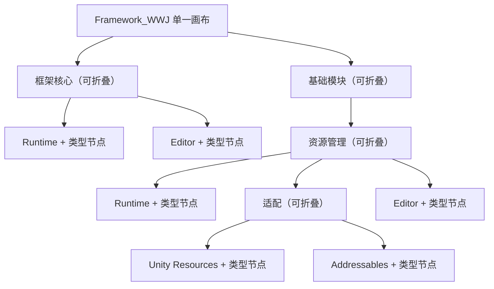

# 声明式单画布代码架构图

> 状态：Phase 1.1 建立类型元数据；Phase 1.2 建立共享视口；Phase 1.4 扩展生产程序集目录；Phase 1.5 改为单画布可展开 Compound Graph。 
> 更新日期：2026-08-20

## 两级元数据边界

### 生产程序集接入

一个程序集只有声明 `FrameworkArchitectureAssemblyAttribute` 才进入正式架构目录。Attribute 维护：

- 稳定分组路径，例如 `base-modules/resource-management/runtime`；
- 与路径逐段对应的中文显示路径；
- 程序集职责；
- 从根到叶的逐级稳定顺序。

模块自行声明所在位置，Core Editor 不硬编码未来模块程序集。Tests、Samples 与第三方程序集默认不接入。

### 类型职责声明

已接入程序集中的顶层类、接口、结构体和枚举必须通过 `FrameworkArchitectureAttribute` 声明显示名称、中文职责、逻辑层、同层顺序和少量关键协作类型。继承与直接接口实现由反射推导；Attribute 不承担逐方法调用分析。

两个 Attribute 都带有 `Conditional("UNITY_EDITOR")`，玩家构建不保留职责字符串、分组路径和关系数组。

## 单画布分组模型

- 根不绘制外框，直接子组纵向排列。
- 分组是带标题栏的嵌套泳道；展开后在原位置显示直属类型和下级分组，不切换页面。
- 新 Unity 会话默认全部收起；用户展开集合通过 `SessionState` 在当前编辑器会话内保存。
- 标题三角或双击切换展开，单击只选择；工具栏可全部展开或全部收起。
- 展开/收起使用 Canvas 锚点补偿 Pan，被操作标题保持在原屏幕位置。
- 右侧详情同时支持分组和类型；类型继续提供 Ping 与外部编辑器打开。

Phase 1.4 的程序集接入与分组树继续存在于目录数据中，但“钻入叶组”的显示方式已由 [ADR-EC-006](./ADR/ADR-EC-006_Expandable_Compound_Architecture_Graph.md) 取代。

## 全局逻辑层布局

整张画布共享七个固定横向列：

1. 契约；
2. 配置；
3. 模块模型；
4. 图与作用域；
5. 运行驱动；
6. 公开门面；
7. 编辑器集成。

分组沿纵向递归展开，同一逻辑层的类型无论属于 Core 还是业务模块都使用相同 X 坐标。分组内部节点继续按 Order、显示名称和类型全名稳定排列。类、接口、结构体与枚举保留各自颜色，选中节点使用橙色强调。

绘制顺序固定为：网格 → 层标题 → 分组背景 → 关系 → 分组标题 → 类型节点。节点不能自由拖动，也不保存坐标。

## 折叠关系语义

- 可见类型之间绘制原始继承、接口实现和显式协作关系。
- 类型隐藏在折叠组内时，端点映射到从根向下遇到的第一个折叠祖先，即当前画布上真正可见的分组代理。
- 映射后相同端点的组内关系不绘制。
- 其余关系按源端点、目标端点和关系种类聚合；聚合数量大于一时显示 `×N`。
- 工具栏可独立开关继承、接口实现和显式协作，默认全部显示。

继承为实线，接口实现为较疏点线，显式协作为较密点线。它们只是架构可视化关系，不增加 Runtime 依赖声明。

## 搜索与展开状态

搜索结果使用独立的临时展开集合：

1. 命中类型时临时展开其所属分组和全部祖先。
2. 命中分组时临时展开该分组和祖先。
3. 搜索变化时适配全部命中节点的联合区域。
4. 非命中节点、分组和关系降低透明度。
5. 清空搜索后恢复用户原来的展开集合。

为了避免“搜索强制展开”与“用户手动收起”产生矛盾，搜索期间暂停分组展开/收起和批量按钮；清空搜索后恢复操作。

## 共享视口

代码架构图与模块依赖图继续共享 `FrameworkGraphViewportState` / `FrameworkGraphViewport`：

- 滚轮以鼠标位置为中心缩放；
- 中键或 `Alt + 左键`平移；
- 工具栏提供适配、100% 和当前缩放百分比；
- 搜索可请求指定区域适配；展开可请求锚点补偿；
- 网格、连线、箭头、节点和点击区域使用同一 Canvas/Viewport 变换。

默认视口仍为 35%–200%。只有代码架构大图使用 10%–200%，确保完全展开后可以观察整体轮廓；低于 35% 时逐步简化节点文字，放大后恢复完整信息。

## 源码索引

`FrameworkSourceScriptIndex` 搜索整个 `Assets/Plugins/Framework_WWJ`：

1. 优先使用 `MonoScript.GetClass()` 建立精确 Type 映射；
2. 对同一脚本中的辅助结构体、枚举和类，解析命名空间与顶层声明名回退；
3. 声明名冲突时不猜测，保持未定位并由目录诊断/测试暴露。

## 当前范围与门禁

当前显式接入 Core Runtime、Core Editor、Resource Runtime、Resource Editor、Unity Resources Integration 与 Addressables Integration，共 11 个目录分组、104 个生产类型节点。

新增生产模块时必须同时完成：

1. 程序集级分组 Attribute；
2. 生产顶层类型职责 Attribute；
3. 源码定位和目录诊断测试；
4. 完全展开后节点唯一性、分组包含和关系代理测试；
5. 模块验收中的 Framework Center 人工检查。

详细决定见 [ADR-EC-003](./ADR/ADR-EC-003_Shared_Navigable_Graph_Viewport.md)、[ADR-EC-005](./ADR/ADR-EC-005_OptIn_Production_Assemblies_And_Hierarchical_Navigation.md) 与 [ADR-EC-006](./ADR/ADR-EC-006_Expandable_Compound_Architecture_Graph.md)。
