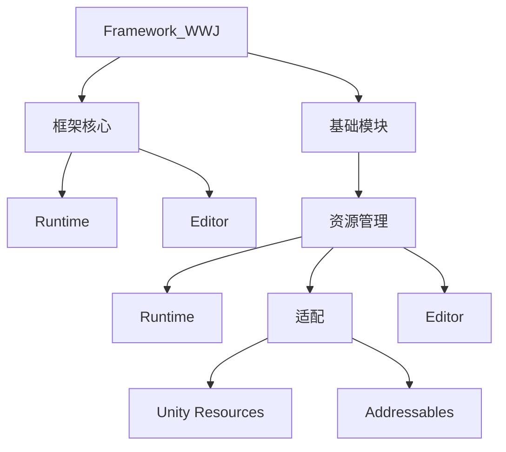

# Phase 1.4：分层代码架构导航器实施计划

## 一、问题与目标

### 已验证事实

- 旧 `FrameworkArchitectureCatalogBuilder` 只扫描 `Framework_WWJ.Runtime` 与 `Framework_WWJ.Editor` 两个硬编码程序集。
- 旧 `FrameworkSourceScriptIndex` 只搜索 `Runtime/` 与 `Editor/` 两个目录。
- Resource Management 已拆成 Runtime、Unity Resources、Addressables 与 Editor 四个生产程序集，因此即使 `ResourceModule` 已声明架构 Attribute，旧目录仍不会发现它。
- 旧视图把全部核心类型放进同一张逻辑层横向图；模块数量增长后，跨层连线会遮挡节点并降低可读性。

### 本阶段目标

1. 所有显式接入的 Framework_WWJ 生产程序集都进入同一个架构目录。
2. 生产程序集中的顶层类、接口、结构体和枚举都必须维护中文名称、职责、逻辑层和关键协作信息。
3. 架构页改为类似 Unity Animator 子状态机的分层导航：先看大分组，打开分组后再看子分组或内部类型。
4. 资源模块的契约、Module/Handler、缓存、Provider、两种后端适配和 Editor 工具均可查看、Ping 并在 Rider 中打开。
5. Tests、Samples、第三方程序集默认不进入正式架构目录。

## 二、分层模型

每个生产程序集通过程序集级 Attribute 声明：

- 稳定分组路径，例如 `base-modules/resource-management/runtime`。
- 中文显示路径，例如 `基础模块/资源管理/Runtime`。
- 该程序集在框架中的职责。
- 同级稳定排序值。

目录构建器只扫描显式声明该 Attribute 的程序集。这样新增模块时，由模块自行接入架构目录，不再修改核心编辑器白名单。

## 三、交互规则

- 根视图和非叶分组显示大尺寸分组节点；节点包含职责摘要、直属程序集数和内部类型数。
- 单击分组节点查看详情；双击分组节点或点击详情中的“打开分组”进入内部。
- 顶部面包屑显示当前位置，并提供“返回上一级”和“回到根目录”。
- 叶分组继续使用现有逻辑层类型图，保留缩放、平移、适配、搜索、选择、双击源码、Ping 与 Rider 打开。
- 分组图中的连线是内部类型关系的聚合，只表达两个直接子分组之间存在依赖，并显示聚合关系数量；具体关系在叶分组中查看。
- 切换分组时自动适配视图；搜索只高亮当前分组，不重置视角。

## 四、代码改动

### Runtime 元数据

- `FrameworkArchitectureAssemblyAttribute.cs`：声明生产程序集的稳定路径、显示路径、职责和顺序。
- `FrameworkArchitectureAttribute.cs`：覆盖范围扩展到类、接口、结构体和枚举。
- Core 与 Resource Management 四类生产程序集的 `AssemblyInfo.cs`：声明分组路径。
- 两个资源适配程序集补充直接 Core Runtime 引用，以便使用程序集级元数据。

### Editor 目录与视图

- `FrameworkArchitectureCatalogBuilder`：改为扫描显式接入程序集，构建分组树、类型节点和跨程序集关系。
- `FrameworkArchitectureGroupDescriptor`：表示可展开分组及其父子关系、程序集和内部类型。
- `FrameworkArchitectureTypeDescriptor`：增加所属分组与 Class/Interface/Struct/Enum 类型种类。
- `FrameworkArchitectureHierarchyDrawer`：绘制非叶分组的大块节点与聚合关系。
- `FrameworkArchitectureGraphDrawer`：只绘制当前叶分组内部类型，不再使用硬编码 Runtime/Editor 筛选。
- `FrameworkArchitectureDetailDrawer`：同时显示分组详情和类型详情。
- `FrameworkSourceScriptIndex`：搜索整个 `Assets/Plugins/Framework_WWJ`，并支持同一脚本中的辅助结构体/枚举定位。
- `FrameworkArchitecturePage`：维护当前位置、面包屑、分组/类型选择和两级绘制切换。

### Resource Management 元数据

为所有生产顶层类型补充 `[FrameworkArchitecture]`，至少覆盖：

- 公开契约：`ResourceKey`、`ResourceLease`、`ResourceBackendKind`、后端 Handle 与加载异常。
- 模块实现：`ResourceModule`、`ResourceHandler`、`ResourceStore`、缓存、租约和合并加载状态。
- Provider：抽象 Provider、Unity Resources 与 Addressables 实现及其后端 Handle。
- 诊断与 Editor：诊断快照、配置校验、构建校验与 Framework Center 页面。

## 五、验收标准

- 架构目录不再包含程序集名称硬编码白名单。
- 所有显式接入的生产程序集顶层类、接口、结构体和枚举均有 Attribute，目录诊断为零。
- 根视图可进入“基础模块 → 资源管理”，并继续进入 Runtime、Editor 或两种适配器。
- `ResourceModule`、`ResourceStore`、`ResourceProviderBase`、`UnityResourcesProvider`、`AddressablesResourceProvider` 和资源 Editor 工具均可见。
- 资源节点显示中文职责和关键依赖；Ping 与打开源码使用正确脚本。
- 现有缩放、平移、适配和代码节点点击行为不回退。
- Core、Resource Management EditMode/PlayMode 既有测试继续通过，并新增目录接入、覆盖完整性、分组树与源码定位测试。

## 六、非目标

- 不修改资源加载、缓存、租约和释放的 Runtime 行为。
- 不把 Tests、Samples 或第三方代码加入正式架构图。
- 不允许手动拖动或保存节点坐标。
- 不实现任意代码调用图或逐方法静态分析。

