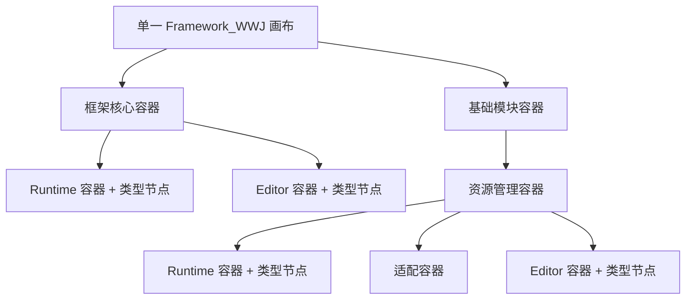

# Phase 1.5：单画布可展开代码架构图实施计划

> 日期：2026-08-20  
> 状态：已实现，自动化验收通过；人工视觉步骤见验收文档

## 一、阶段目标

把 Phase 1.4 的“分组视图 / 叶级类型图”互斥导航改成一张完整 Compound Graph：分组作为同一画布内的可折叠容器，叶分组展开后直接显示具体类型节点和关系，不再切换目录页面。

本阶段保留生产程序集显式接入、类型职责 Attribute、源码定位和目录诊断；不修改 Framework Runtime、Resource Management 行为或中央配置资产。

## 二、已确认交互

- 新 Unity 会话默认全部分组收起。
- 展开状态仅通过 `SessionState` 在当前 Unity 会话内保存。
- 分组使用标题栏三角按钮或双击标题展开/收起；单击只选择。
- 工具栏提供“全部展开”“全部收起”以及继承、接口实现、显式协作三类关系开关。
- 展开/收起时保持被操作标题的屏幕位置，不自动适配全图。
- 搜索临时展开命中类型或分组的祖先路径；清空后恢复用户展开状态。
- 折叠组内的关系汇聚到最近的折叠祖先分组，按端点和关系种类聚合。
- 代码架构图缩放范围为 10%–200%；其他共享节点图保持 35%–200%。

## 三、布局与绘制

- 根节点不绘制外框，直接子组纵向排列。
- 七个逻辑层使用整张画布共享的固定 X 列；各分组作为纵向嵌套泳道。
- 展开分组先排列直属类型，再排列子组，支持未来非叶分组拥有直属类型。
- 递归布局输出分组边界、标题边界、类型边界、内容边界和最终显示关系。
- 绘制顺序固定为网格、逻辑层标题、分组背景、关系、分组标题、类型节点。
- 低于 35% 时减少类型节点文字；放大后恢复完整名称、类型名和种类。

## 四、关系与状态规则

每条原始类型关系先检查关系筛选，再解析当前可见端点：

1. 类型可见时端点仍为类型节点。
2. 类型被折叠祖先隐藏时，端点变为最近的折叠祖先分组。
3. 映射后源端点与目标端点相同则不绘制。
4. 其余关系按源端点、目标端点和关系种类聚合。
5. 至少一端为分组且聚合数量大于一时显示 `×N`。

用户展开集合与搜索临时展开集合保持分离。目录刷新只保留仍存在的 GroupId；若当前选中类型因收起祖先而隐藏，选择自动切换到该折叠分组。

## 五、代码边界

- `FrameworkArchitecturePage`：持有页面选择、搜索、关系筛选和展开状态，移除面包屑与目录切换。
- `FrameworkArchitectureGraphDrawer`：统一绘制 Compound Graph 并返回选择/展开交互。
- `FrameworkArchitectureGraphLayout`：纯布局结果、递归布局算法和聚合显示关系。
- `FrameworkArchitectureExpansionState`：维护用户展开集合、搜索临时展开和 SessionState 序列化。
- `FrameworkGraphViewportState`：支持实例级缩放范围、指定区域适配与锚点修正。
- `FrameworkArchitectureDetailDrawer`：分组详情按钮改为展开/收起。
- 删除不再使用的 `FrameworkArchitectureHierarchyDrawer`。

## 六、验收门禁

- 完全展开时每个生产类型恰好出现一次，且同逻辑层节点拥有一致 X 坐标。
- 子组和类型位于父组容器内部，节点之间不重叠。
- 折叠关系映射、聚合、筛选和组内隐藏语义通过 EditMode 测试。
- 搜索不会污染用户展开集合；清空后恢复。
- 代码架构图可缩放到 10%，其他图仍保持 35% 下限。
- 架构目录诊断为零，Resource Management 类型和源码定位不回退。
- Framework_WWJ 全部 EditMode、PlayMode 测试通过。

详细决策见 [ADR-EC-006](./ADR/ADR-EC-006_Expandable_Compound_Architecture_Graph.md)，实际结果见 [Phase 1.5 验收与复盘](./11_Phase1_5_Expandable_Compound_Architecture_Graph_Acceptance_And_Review.md)。
