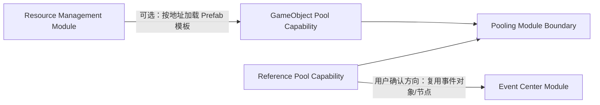

# FrameWork_Ranger 基础模块建设纲领

> 日期：2026-08-19  
> 状态：Resource Management 已关闭；下一候选为 Pooling，仍需独立批准。

## 1. 用户目标

围绕已经完成的 Module/Scope 骨架，逐个设计、实现并验收三类基础能力：

1. 资源管理模块；
2. 对象池/引用池模块；
3. 事件中心模块。

同时建立一条可重复的 AI 接入流水线，使后续用户只需描述模块目标、功能范围和架构思路，AI 就能按固定门禁完成资料加载、Skill 路由、设计计划、代码/SO/配置、测试和文档回写。

## 2. 参考定位

| 参考 | 定位 | 使用方式 |
| --- | --- | --- |
| LyingBottle | **事实：** 使用 HTY/ActFramework 的真实游戏项目 | 验证模块如何接入 Global 生命周期、SO 配置、Handler、游戏调用点与编辑器诊断 |
| HTY/ActFramework | 模块化框架与大型工程样本 | 学习问题定义与成熟用例，同时主动削减多生命周期、全局静态入口和大型聚合依赖 |
| YokiFrame | 可独立引入的 Kit 与工具链样本 | 学习能力拆分、显式所有权、Provider/Handle、可选集成和计划式安装 |

参考项目均默认只读。正式 API、类名和序列化结构由 FrameWork_Ranger 的模块阶段重新设计。

## 3. 已确认方向与待定边界

### 已确认方向

- 三个基础模块逐个推进，不并行一次性实现。
- EventCenter 将依赖对象/引用池系统；依赖的精确层级仍需设计。
- 每个正式模块都必须接入现有 Module SO、Scope 生命周期、依赖图、中央设置和测试体系。
- AI 流水线必须覆盖“查找/加载 Skill → 设计计划 → 代码与 SO → 配置 → 测试 → 文档回写”。
- 未来考虑用专门 App 管理框架源码仓库、模块选择、向游戏项目安装/更新，以及在游戏开发期间反向维护框架源码。

### Resource 阶段已关闭的决定

- 正式顺序采用 Resource → Pooling → Event。
- ResourceModule 是 Global 模块，采用 `BaseModules/ResourceManagement` 垂直胶囊。
- 首版同时要求 Unity Resources 与 Addressables 1.22.3，使用显式后端 Key、Lease 与 single-flight。
- 详细事实与 ADR 见 [Resource Management 入口](./ResourceManagement/README.md)。

### 仍待决定

- 对象池与引用池是一个 Module 的两个能力，还是两个独立 Module。
- EventCenter 依赖整个 PoolingModule，还是只依赖最小的引用复用接口。
- Pooling 的 GameObject 池是否只通过 ResourceModule 加载模板，或同时允许直接 Prefab 模板。
- Pooling 的精确程序集拆分、配置、预热、容量和回收策略。

## 4. 候选依赖图

这张图是需求分解，不是最终程序集依赖。尤其要避免为了复用一个事件节点，让 EventCenter 被迫依赖 GameObject、Transform 或资源后端。

## 5. 候选实施顺序

### 方案 A：Resource → Pooling → Event（当前建议进入讨论）

- Resource 先定义资源所有权与 Prefab 获得方式。
- Pooling 可完整覆盖引用池与 GameObject 池，并按需要使用 Resource。
- Event 最后只消费 Pooling 中最小的引用复用能力。

优点是模块可以一次收口；缺点是最复杂的 Resource 先开始，第一轮学习成本较高。

### 方案 B：Reference Pool → Event → Resource → GameObject Pool 集成

优点是先用纯 C# 小能力验证流水线；缺点是 Pooling 模块会在 Resource 完成后再次打开边界，违反“一次完成一个模块”的直觉。

### 方案 C：Event 独立 → Resource → Pooling

YokiFrame 证明 Event 可不依赖 Pool；但这不满足用户已提出的 EventCenter 依赖池化方向，除非后续用户修改需求。

正式顺序由第一个模块的需求会议确认。本文不以“建议”替代决定。

## 6. 每个模块必须回答的问题

- 谁创建、持有、访问和销毁运行时状态？
- Module SO 保存配置，Handler/Provider 保存什么逻辑，运行克隆里保存什么状态？
- GlobalScope 和 SceneScope 分别允许哪些实例？
- 同步、异步、取消、失败、重试和 Shutdown 如何表现？
- 模块依赖的是具体 Module 类型、公开契约还是可选适配程序集？
- 资产、句柄、订阅、借出对象的所有权如何可见且可测试？
- 哪些操作会产生 GC、主线程阻塞或 Unity 对象泄漏？
- Editor Center 需要提供配置、运行时检查还是只读诊断？
- 如何用 EditMode、PlayMode 和一个实际示例证明它工作？
- 模块被移除后，项目是否仍能编译，依赖模块如何给出清晰诊断？

## 7. 程序完成标准

三类模块全部完成时，不仅要有代码，还要形成：

- 可独立理解的模块文档与 ADR；
- 明确依赖方向的程序集和目录；
- SO 模板、中央配置与示例资产；
- 自动化测试和人工验收路径；
- Framework Center 中适量而非强制的大型编辑器支持；
- 可供未来分发 App 读取的模块身份、版本、依赖和安装边界设计。
