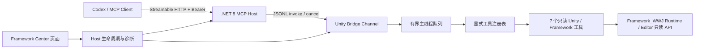
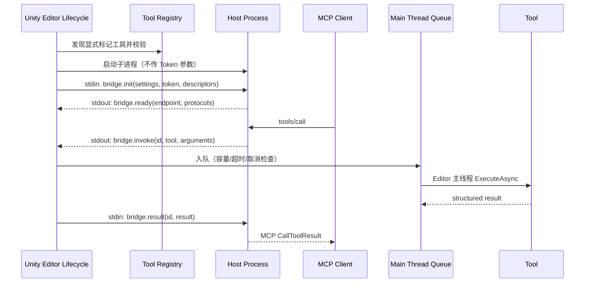
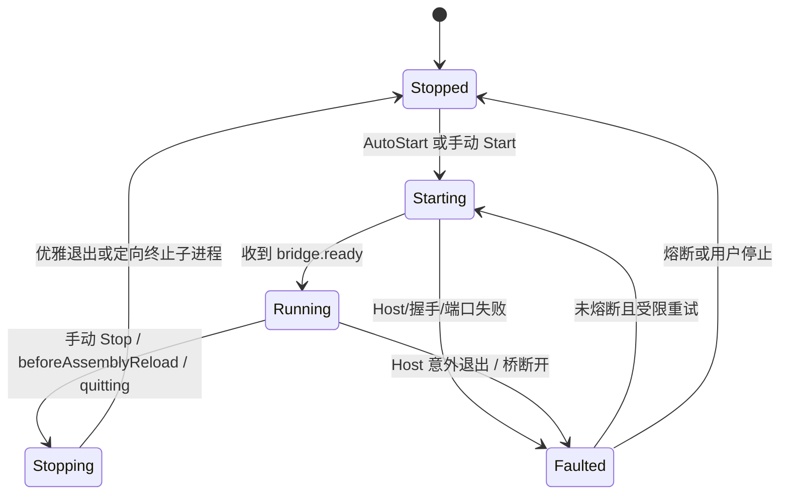

# Editor MCP Adapter 架构与公开契约

> 状态：提议；以 [ADR-EMA-001](./ADR/ADR-EMA-001_Editor_Adapter_And_External_Host.md) 获批为前提。

## 1. 逻辑层次



依赖只向内：Host 不引用 Unity；Adapter Editor 引用 Framework Runtime/Editor；Core Runtime 不反向引用 Adapter。

## 2. 启动与调用时序



## 3. Reload 与 Shutdown



- `beforeAssemblyReload` 先停止接单并取消队列，再关闭 Host。
- Host 监视 Unity 父 PID 与 stdin；父进程退出或管道断开即自退，防止孤儿进程。
- Reload 后不恢复旧请求；客户端重新连接并重新发现工具。

## 4. MCP 协议边界

- Host 使用官方 C# SDK 2.0.x，以 MCP `2026-07-28` 为主协议，并保留 SDK 提供的旧客户端兼容。
- 第一版只声明 tools 能力；目录在 Host 进程启动时固定，按工具名序号排序。
- 每个工具同时提供 `inputSchema`、`outputSchema`、`structuredContent` 和简短 text 摘要。
- 只读工具标记 `readOnlyHint=true`、`destructiveHint=false`、`idempotentHint=true`、`openWorldHint=false`。
- 不实现 prompts/resources/tasks/subscriptions；不提供自定义 `/tools/call` 旁路。
- 当前规范参考：
  - <https://modelcontextprotocol.io/specification/2026-07-28>
  - <https://csharp.sdk.modelcontextprotocol.io/v2/>

## 5. Unity 桥契约

每条消息是一行 UTF-8 JSON，最大 4 MiB，字段采用 lowerCamelCase。Host stdout 只允许桥消息；日志全部写 stderr。

| 消息 | 方向 | 必需字段 | 语义 |
| --- | --- | --- | --- |
| `bridge.init` | Unity → Host | protocolVersion、projectId、port、token、tools | 启动前一次性注册 |
| `bridge.ready` | Host → Unity | endpoint、hostVersion、protocolVersions | HTTP 已可用 |
| `bridge.invoke` | Host → Unity | requestId、toolName、argumentsJson、deadlineUtc | 请求执行 |
| `bridge.cancel` | Host → Unity | requestId、reason | 请求取消 |
| `bridge.result` | Unity → Host | requestId、isError、contentJson、errorCode、message | 正常/业务失败 |
| `bridge.shutdown` | Unity → Host | reason | 优雅退出 |
| `bridge.fault` | 双向 | code、message | 桥级故障 |

`requestId` 只在一个 Host 进程内唯一。Host 维护等待表；Unity 维护排队表，任何一侧断开都完成所有等待项为错误。

## 6. Unity 工具公开契约

```text
IFrameworkMcpTool
  Name / Title / Description
  InputSchemaJson / OutputSchemaJson
  Risk / Timeout
  ExecuteAsync(argumentsJson, context, cancellationToken)
```

- 工具类必须带 `[FrameworkMcpTool]`，否则不进入生产目录。
- 名称区分大小写，限定 1–128 个 `[A-Za-z0-9_.-]` 字符；重复名称使 Host 启动失败，不静默覆盖。
- 参数由 Host 按 JSON Schema 2020-12 校验；Unity 侧仍做范围、路径、对象存在性等领域校验。
- 第一版工具只读，因此 `Risk=ReadOnly`；未来写工具必须引入新的风险/确认 ADR。

### 第一版工具

| 名称 | 输入 | 结构化输出 | 限制 |
| --- | --- | --- | --- |
| `framework.get_status` | 空对象 | Framework state、ready、lastError、PlayMode/compile 状态 | 不返回堆栈中的敏感绝对路径 |
| `framework.list_modules` | scope、includeDisabled | 配置模块、运行模块、生命周期、依赖与诊断 | 最多 256 项 |
| `framework.validate_configuration` | 可选 scenePath | 错误/警告代码、位置、消息 | 复用现有 Resolver/Graph，不复制算法 |
| `unity.get_project_info` | 空对象 | Unity 版本、产品名、平台、活动场景、编译/播放状态 | 项目路径默认只返回项目名与稳定 projectId |
| `unity.read_console` | severity、contains、limit | 日志类型、消息、堆栈摘要、总数/截断 | limit 1–200；只读 Console |
| `unity.find_assets` | filter、roots、limit | guid、assetPath、mainType | roots 必须在 `Assets/` 或 `Packages/`；limit 1–500 |
| `unity.get_scene_hierarchy` | scenePath、rootPath、maxDepth、limit、includeComponents | 层级路径、active、tag、layer、组件类型 | 深度 0–8；最多 1000 节点 |

## 7. 配置、SO 与 Framework Center

- 不创建 Module SO/Handler/Provider，不加入 GlobalConfig/SceneConfig。
- `McpAdapterSettings` 使用 `ScriptableSingleton` 保存到 `Library/Framework_WWJ/Mcp/Settings.asset`；
  保存 autoStart、端口/扫描范围、超时、启用工具和 Host 发布物路径，不保存运行状态。
- Token 独立保存到 `Library/Framework_WWJ/Mcp/token`；UI 默认只显示掩码，复制与重置要求显式点击。
- Center 页面 ID：`framework.module.editor-mcp-adapter`，分类“模块”，提供：
  Host 构建、启停、状态、端点、协议、Token、工具目录、最近请求、诊断、Smoke Test 和配置片段复制。
- 页面不在 `OnGUI` 中执行扫描、构建或进程调用；所有重量操作只在按钮回调启动，并通过状态对象显示进度。

## 8. 安全与失败策略

- Host 仅监听 `127.0.0.1`，拒绝非本机 Host、非允许 Origin 和通配 CORS。
- Bearer Token 默认必需；无 Token/错误 Token 返回 401；Token 不写日志、不进入进程参数。
- 工具 allowlist 来自显式标记 + 项目本地启用列表，默认只启用 7 个只读工具。
- 未知工具、重复工具、非法 schema、Host 发布物版本不匹配均在监听端口前失败。
- 队列满返回 `busy`；超时返回 `timeout`；Reload/退出返回 `editor_reloading`/`editor_quitting`。
- 单个工具异常不终止 Host 或队列；异常转换为 `isError=true`，日志只保留必要摘要。
- 启动部分成功时逆序清理：停止 HTTP → 完成等待请求 → 关闭桥 → 退出/终止子进程 → 清空内存状态。

## 9. 程序集与分发边界

```text
Framework_WWJ.Runtime
          ↑
Framework_WWJ.Editor
          ↑
Framework_WWJ.BaseModules.EditorMcpAdapter.Editor
          ↑
Framework_WWJ.BaseModules.EditorMcpAdapter.Tests.EditMode / Tests.PlayMode

Host~/.NET 8 executable --JSONL only--> EditorMcpAdapter.Editor
```

Host 源码位于模块 `Host~`（Unity 忽略目录），开发时显式发布到 `Library/Framework_WWJ/Mcp/Host`。
发布版本再按 RID 生成独立附件；第一版不把构建产物提交为 Unity 资产。
