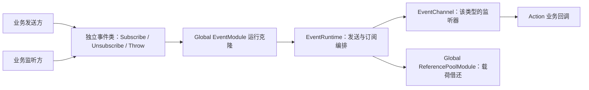

# Event Center 架构与公共契约

本页汇总截至第六轮已确认的公共行为，并给出实现这些行为的具体设计。问答与来源以 [requirements.json](../../../../../../../.workflow/event-center/requirements.json) 为准，执行状态以 [progress.json](../../../../../../../.workflow/event-center/progress.json) 为准。本文是实现依据，不是已经存在的 Runtime API 或测试通过记录。

主要依据：REQ-005/006 的 HTY 业务用法与独立事件类，REQ-008 至 REQ-016 的作用域、订阅、发送和生命周期决定。参考证据见[源码研究](./01_Reference_Research_And_Design_Starting_Point.md)和 [HTY 使用场景](./02_Event_Class_API_And_HTY_Usage.md)。

## 1. 模块结构

EventModule 仅安装于 GlobalScope。事件类静态入口查询当前已经加载的模块；订阅表、引用池依赖和派发状态全部属于模块运行实例。Core 继续负责 SO 克隆、依赖排序和卸载。

拟用命名空间 `FrameWork_Ranger.Events`，Runtime 程序集为 `FrameWork_Ranger.BaseModules.EventCenter.Runtime`。直接程序集依赖为 Framework Runtime、Pooling Reference Runtime 和 UniTask；不会通过 GameObject Pool 或 Resource 获取事件能力。



这里的连线表示调用关系。模块级必需依赖由 EventModule 声明 `ReferencePoolModule`；加载顺序是 Reference Pool → Event → 依赖 Event 的业务模块，卸载顺序相反。

EventModule 采用现有 `DirectModuleBase`。当前只有一种派发策略，没有需要切换的后端，运行算法放入普通 C# EventRuntime 即可；不配置空 Handler。此项是实现组织决定，不改变用户已确认的接口行为。

## 2. 公共类型与调用方式

### 事件载荷

`EventBase` 实现 `IReferencePoolItem`，默认 OnRent 为空，OnReturn 由具体事件重写以清理本次数据。业务事件为可实例化、具有公共无参构造函数的独立 class，推荐 sealed；一个事件类型一个文件。

```csharp
// 拟实现的基类契约。
public abstract class EventBase : IReferencePoolItem
{
    public virtual void OnRent() { }
    public abstract void OnReturn();
}
```

业务字段由该事件的静态 Throw 填充，推荐以只读属性提供给监听方。引用池方法不会替业务推断需要清空哪些字段；字符串、集合引用和业务对象引用均由事件自身明确清理。无载荷通知仍有独立事件类和空的 OnReturn。

### 事件中心

拟公开的核心方法签名为：

```csharp
void Subscribe<T>(Action<T> callback) where T : EventBase;
void Unsubscribe<T>(Action<T> callback) where T : EventBase;
void Publish<T>(Action<T> initialize = null) where T : EventBase, new();
```

具体事件类按以下方式包装这些方法，业务不需要重复填写泛型类型：

```csharp
// 以 LevelChangedEvent 为例；这些调用为设计示意。
LevelChangedEvent.Subscribe(OnLevelChanged);
LevelChangedEvent.Throw(entityId, previousLevel, currentLevel);
LevelChangedEvent.Unsubscribe(OnLevelChanged);
```

Subscribe/Unsubscribe 使用 `Action<LevelChangedEvent>`，可传入业务对象的实例方法。Subscribe 返回 void，第一版不额外返回 Token。Throw 的参数由各事件的业务数据决定，内部调用 `Publish<LevelChangedEvent>(initialize)`；无载荷事件调用 `Publish<ResourcesReloadedEvent>()`。

静态入口保留在每个事件类中，统一转发到已加载的 EventModule。第一版没有传入外部已借出实例的 Publish 重载，避免把“谁负责归还”分成两套约定。使用初始化委托可能产生闭包分配，当前不承诺零 GC，也不为此增加一组未要求的优化重载。

## 3. 订阅身份与路由

- 按精确泛型事件类型 T 选择通道。具体事件类固定 T，发送和订阅不会因基类变量或继承关系发生隐式广播。
- 同一事件类型内，相同委托去重；同一个对象的同一方法重复 Subscribe 只保留一项，位置保持第一次注册的位置。
- 不同对象上的同一个方法各自是一项订阅。一次 Unsubscribe 移除该匹配项，再次注销无副作用。
- Subscribe 的空回调属于参数错误；Unsubscribe 的空回调或未注册回调按无操作处理。这是与成对清理一致的参数边界设计。
- 注销后重新订阅视为新订阅，排到当前有效监听列表末尾。
- 监听方保存捕获 lambda 的原委托用于注销；另写一个相似 lambda 不等于原订阅。
- 第一版采用普通持久订阅和注册顺序，不增加 priority 或 SubscribeOnce。

回调被事件中心持有，业务有责任在面板关闭、组件停用或模块卸载时注销；跨场景共享不意味着场景对象订阅会自动解除。

## 4. 单次派发与嵌套

每次发送的过程是：验证主线程和模块状态 → 借出 T → 填充数据 → 同步调用本轮监听器 → 归还 T → 返回发送方。

开始遍历监听器时确定本轮进入边界。派发期间新增监听器不参与已开始的本轮；已注销且尚未执行的监听器立即跳过。当前已经执行中的回调可完成自己的函数体，注销不会中断正在运行的方法。

| 操作场景 | 明确结果 |
| --- | --- |
| A、B、C 按顺序注册，无变更 | 执行 A → B → C |
| A 注销 C，并注册 D | 本轮执行 A → B；D 不加入本轮 |
| A 注销自己 | A 当前函数继续执行，随后 B、C 正常执行；A 不再参加后续发送 |
| A 注销 B 后重新订阅 B | 旧 B 本轮跳过，新 B 在后续发送中按新位置执行 |
| A 注册 D 后发起一次内层发送 | 内层有自己的进入边界，可以看到 D；外层仍不调用 D |

支持同类和不同类事件的同步嵌套。示例顺序为 `外层 A 开始 → 内层 X → 内层 Y → 外层 A 结束 → 外层 B`。内层先归还自己的载荷，外层载荷直到外层发送结束才归还。同类递归是否终止由业务条件决定，框架不设置任意递归次数上限。

推荐内部实现采用每类型的有序监听列表和委托索引：派发期间注销用空项标记，新增追加，外层派发完成后再稳定压缩。每次调用只记录自己的列表长度边界，避免每发送一次就复制完整监听列表。压缩、空通道移除和字典维护必须在该通道不处于派发中时进行；这种内部组织可以在实现时调整。

## 5. 载荷所有权与异常

引用池拥有对象的长期生命周期；EventRuntime 临时借用它完成一次发送；监听器仅在回调期间借读。监听器不得自行 Return，也不能缓存池化事件实例用于协程、异步延续或下一帧。延后处理应复制所需数据；复制一个可变业务对象的引用不等于复制状态快照。

整个借还区间包含初始化回调。无人监听时仍执行这次发送的初始化与归还，避免根据监听人数改变填充函数的执行行为。

异常边界按职责分别处理：

| 失败位置 | 处理 |
| --- | --- |
| 线程、就绪或参数错误 | 在借用载荷前明确报错 |
| Rent / OnRent 失败 | 传播池的原始错误；尚未成功借出对象时不额外 Return |
| 初始化回调失败 | 停止本次派发，仍尝试归还；保留并传播初始化错误 |
| 某监听回调失败 | 记录事件类型、监听方法和原始异常，继续剩余监听；不向发送方重新抛出该监听异常 |
| Return / OnReturn 失败 | 不重试归还，保留池的清理错误；若初始化同时失败，用 AggregateException 保留两项原因 |

归还与发送计数收尾必须使用 finally 保证执行。池当前在 OnReturn 失败时负责移出借出集合并清理对象；事件模块不复制一套池修复逻辑。同步 Action 回调中的异步工作在首次挂起后已超出派发范围，不能依赖事件中心捕获其后续异常或保留载荷。

## 6. 加载、就绪与卸载

### 加载与调用

OnLoadAsync 校验 GlobalScope，从 `ModuleContext` 获取已加载的 ReferencePoolModule，再建立本轮运行容器。Module SO 仅承载模板身份和继承的模块配置，运行监听表不序列化进资产。加载取消或失败时清理已建立的临时状态。

模块就绪依据是 EventModule 自身完成加载，不要求整个框架永远处于 Ready：Global 事件中心在场景切换期间仍可使用。依赖事件的业务 Module 声明 RequiredModuleTypes；普通 MonoBehaviour 可等待现有 `Framework.WhenReadyAsync`，并处理该组件在等待期间停用或销毁的取消。

Subscribe/Publish 在未加载或卸载中明确报错，不排队、不隐式创建中心。事件类的 Unsubscribe 经 `Framework.TryGetModule<EventModule>` 查询，无可用中心时安全结束；直接持有旧模块引用时，Unsubscribe 也应允许已卸载后的幂等清理。

### 卸载与当前派发

正常卸载时先停止接收新订阅和发送，清空监听引用，再释放运行容器。Reference Pool 因依赖关系在 Event 之后卸载。

还需覆盖“回调内发起 Framework.ShutdownAsync”的实际调用边界：现有 `FrameworkOperationQueue.Enqueue` 在队列空闲时可立即执行操作，`ModuleScopeRuntime` 则逐个 await 模块卸载。因而 Event 的 OnUnloadAsync 可能在一次同步 Publish 尚未返回时被调用。

此时 EventRuntime 先把中心标记为停止接收，清除后续监听的有效性，等待当前所有发送完成归还后再结束卸载。等待只用于卸载，不把正常发送改为异步队列；业务发起关闭后应让当前同步回调返回，不能阻塞主线程等待自己的派发结束。

活动发送计数覆盖 Rent、初始化、监听和 Return 的整个区间，嵌套发送分别计入。关闭请求到达后不再启动新一轮派发；完成最后一次归还后通知卸载继续。这样可沿用 Core 现有 await 顺序，避免池先强制清理仍在回调中使用的载荷。此项是落实已确认载荷所有权和模块生命周期的必要实现细节。

## 7. 当前范围

第一版包含独立事件类静态入口、全局事件模块、普通同步订阅、引用池载荷借还、必要配置与使用示例。Token、自动生命周期绑定、priority、SubscribeOnce、场景隔离中心和延迟队列已不在当前首版范围。

缓存信号、事件历史回放、字符串/枚举总线、跨线程投递、代码生成器和独立 Event Editor 页面没有当前调用要求，不加入本次最小实现。已有 Framework Center 可展示模块模板及依赖；需要新增能力时再按实际需求扩展。

具体落盘路径和验证范围见[最小实施计划](./04_Implementation_Plan.md)。
