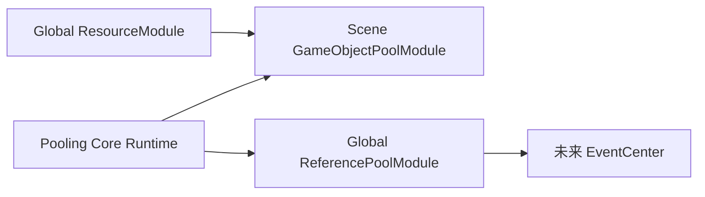

# Pooling 架构与公共契约

## 依赖与作用域



`Pooling.Core.Runtime` 不引用 Resource 或具体 Unity 资源后端。Reference Runtime 只依赖 Core 与 Framework Runtime。GameObject Runtime 依赖 Core、Framework Runtime 和 Resource Management Runtime，不引用 Addressables/Resources Integration。

## Reference Pool

```csharp
public interface IReferencePoolItem
{
    void OnRent();
    void OnReturn();
}

public sealed class ReferencePoolModule
{
    public T Rent<T>() where T : class, IReferencePoolItem, new();
    public void Return(IReferencePoolItem item);
    public bool TryReturn(IReferencePoolItem item);
    public void ClearInactive<T>() where T : class, IReferencePoolItem;
}
```

首次 `Rent<T>` 按默认容量惰性建立精确类型池。配置覆盖在 Global Load 时验证类型、公共无参构造与容量并预热。永久移出池的对象若实现 `IDisposable`，会执行 `Dispose`。

## GameObject Pool

```csharp
public interface IGameObjectPoolCallbacks
{
    void OnSpawned();
    void OnDespawned();
}
```

`GameObjectPoolModule` 公开 `Spawn/TrySpawn`、`Despawn/TryDespawn` 与 `ClearInactive`。池名使用 `StringComparer.Ordinal` 且禁止首尾空白。创建时缓存根与全部子节点回调；Spawn 设置父节点和世界姿态、激活后正序回调，Despawn 逆序回调、停用并归还隐藏根。预热不触发回调。

## 容量算法

`PoolCapacitySettings` 包含 `InitialCount`、`ExpansionBatchSize`、`MaxRetained` 和 `IdleShrinkIntervalSeconds`。默认值：Reference 为 `30/20/-1/15s`，GameObject 为 `0/5/-1/120s`。

- 空池借用按扩容批次创建；有限空闲上限时最多创建“一份借出 + 当前可保留空位”。
- 完全空闲后才计时；任何借出活动都会恢复完整周期。
- 每次到期删除一个扩容批次，且不低于 `InitialCount`。
- 超出有限 `MaxRetained` 的归还对象先完成 Return/Despawn 回调，再永久移除。
- `ClearInactive` 可以清到零，不触碰借出对象。
