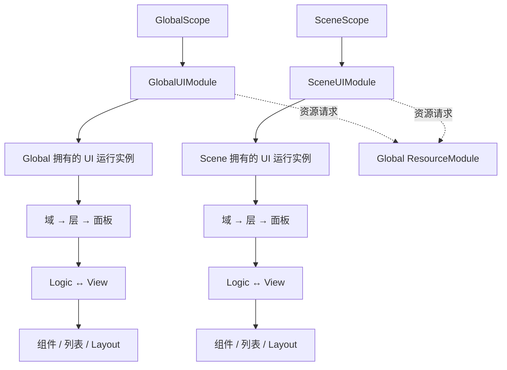

# UI 需求与设计起点

2026-09-09。本文保留问答期间的设计演进，早期候选以 [当前公共契约](./03_Architecture_And_Public_Contracts.md)和任务 requirements.json 为准。关键问答已完成，具体实现等待用户审阅方案。

## 1. 已确认范围

- REQ-UI-003：Global + Scene 两种生命周期，首期包含 Overlay、Camera、World 三种渲染域。
- REQ-UI-004：Logic + View 分离。
- REQ-UI-005：横向、纵向、网格自定义布局、内容适配、忽略项与统一刷新调度。
- REQ-UI-006：以 HTY 配置式面板关系为主，分清显示顺序、焦点与输入、关闭联动。具体父子关系、缓存、返回栈等未逐项确认的细节继续保留为候选。
- REQ-UI-007：每个面板可配置关闭隐藏保留或关闭销毁释放；所属 Scene/Global 模块卸载时统一清理。保留期间持续持有所需资源。
- REQ-UI-008：首期同一 Global/Scene 所有者下每个 panel key 最多一个受管实例，包括关闭后保留的实例。重复打开不创建第二份；不同 owner 隔离。
- REQ-UI-009：基础运行时组件工具包括按钮点击/长按/交互开关、切换与选择组、滚动至项、View/Item、按 key 同步列表、RectTransform 与布局刷新工具，兼容普通 Image/TMP。用户选择首期不纳入拖拽、折叠组和动画。
- REQ-UI-010：Editor 接入 Framework Center，提供面板配置/Prefab 骨架创建与组件/引用校验，View 引用手动拖拽；绑定代码生成不纳入首期。
- REQ-UI-011：Global Camera/World 域失去场景相机或挂载点时，保留实例与打开状态，暂停显示和输入；同域重绑定后恢复，不重放打开回调。Scene UI 随模块卸载清理。
- REQ-UI-012：重复 Open 已打开实例时，通过独立刷新回调更新数据并在所属显示层内置顶，不创建新实例、不重放 OnOpen。
- REQ-UI-013：模态输入限制可配置域内/全局，默认域内，不暂停游戏、角色或时间。
- REQ-UI-014：弹窗明确依附父面板，父子限同 owner/域，按自身依附链关闭，关闭子项恢复可操作父项焦点，不允许抢占已属于其他父面板的单实例弹窗。

问答节奏：保留带选项弹窗，每次只问一个问题，先给背景与参考做法；未收到实际回答就保持待答，不按经过的时间替用户选择或推进。当前提问工具未提供可修改的超时参数，此约定控制助手的推进行为，不声称改变客户端计时。

三种渲染域分别表达：屏幕覆盖 UI、由指定相机渲染的屏幕 UI、位于世界坐标中的 UI。**渲染域不是 Framework Scope**：Scope 决定谁负责卸载，域决定 UI 如何组织和显示。

## 2. 历史结构提案（已废弃）

本节双模块图仅保留设计演进。用户已确认改为单个 GlobalUIModule，由内部 Global/Scene 所有者管理两种 UI 生命周期；实施必须使用 03 的单模块方案。下文旧“所属 Scene 模块卸载”统一按对应 SceneScope 所有者结束清理理解。

两个具体 Module 类型兼容当前按类型去重的 Core，共享 UIRuntime 实现与配置形状。业务显式选择 Global/Scene 门面，面板内部由注入的 owner 打开或关闭自身，不回退到当前场景查找。

拟放在 `BaseModules/UI/`，至少分 Runtime、Editor、Samples 和必要 Tests；如引入池或动画的可选适配，再按真实依赖增加 Integration。Core 不反向引用 UI。生产类型维护现有架构元数据。

| 关键角色（候选名称） | 责任与协作 |
| --- | --- |
| GlobalUIModule / SceneUIModule | Scope 接线、配置、公共操作，严格验证安装位置 |
| UIRuntime | 持有域与面板记录，编排资源准备、状态转换、清理 |
| UIDomainDefinition / UIPanelDefinition | 域、层、资源 key、Logic 模板及面板策略；不保存运行时场景引用 |
| UIDomain | 拥有呈现根、排序容器、所属面板和绑定状态 |
| UILogic<TView> | 打开/关闭/刷新时处理数据、订阅、按钮接线与业务命令 |
| UIView / UIItemView | Prefab 上的组件引用、局部表现和可复用条目；不给 View 再加一套全局单例 |
| UIPanelHandle | 标识具体 owner/面板轮次，防止旧调用操作已卸载或重新创建的实例 |
| UILayoutScheduler | 收集与合并布局根刷新，提供批处理和立即结算 |
| UIListController | 稳定 key 同步条目、解绑和清理，再统一请求布局 |

小面板可以使用默认 Logic，仅在确有业务处理时派生逻辑类；首期采用手动引用绑定，配套配置/Prefab 骨架创建与校验，不提供绑定代码生成（REQ-UI-010）。

## 3. 所有权与三种域

Global 的 UI 根随 Global 卸载；Scene 的根随其 SceneScope 结束清理。UI 运行实例拥有自己创建的根和面板；相机、场景挂载点是借用对象，UI 清理不得销毁借用对象。

Camera 域需要明确渲染相机；World 域需要位置/尺寸与用于交互的相机。建议由场景组件按域 key 注册实际对象，并在禁用/销毁时解除；不要静默以 Camera.main 兜底。Global 域解绑时暂停呈现和输入、保留实例与打开状态、重新绑定后恢复且不重放 OnOpen，已经确认（REQ-UI-011）。Global 自有实例必须留在其生命周期根下；World 借用目标可用于同步位姿，不能把保留实例直接挂在随场景销毁的父节点下。解除绑定须清除借用引用，迟到的旧解绑不能清除新绑定。

Global 与 Scene 的 Overlay 域必须定义可比较的排序范围，保证全局加载遮罩可以覆盖场景 UI。Camera/World 的顺序还受相机/渲染条件影响，不应只靠一个整数承诺跨模式统一遮挡。

## 4. 首轮之后需确定的公共行为

1. **关闭策略与实例数**：KeepAlive 关闭隐藏、DestroyOnClose 关闭销毁，逐面板配置及所属模块卸载统一清理已确认（REQ-UI-007）；缓存实例持续持有 lease。每个 owner + panel key 最多一个实例已确认（REQ-UI-008）。重复打开刷新并同层置顶，不重放 OnOpen（REQ-UI-012）。预加载与关闭策略分开配置。
2. **面板关系**：推荐普通并存、同组互斥、依附父面板的弹窗；关闭父面板关闭其依附链。失焦不等于关闭，需要单独限制输入并恢复焦点。通用页面返回栈作为另一选择。
3. **组件与工具**：基础运行时范围已由 REQ-UI-009 确认；Editor 创建、校验、手动绑定由 REQ-UI-010 确认。拖拽、折叠组、动画与绑定代码生成不纳入首期。
4. **Camera/World 绑定**：跨 Scene 解绑与重绑定已确认（REQ-UI-011）；注册时机、首次未绑定打开的结果在正式契约中明确。Global 模态遮罩是否同时限制 Scene UI 输入仍需设计说明。
5. **调用契约**：key 与类型入口、数据传入/刷新、重复打开、并发取消、事件通知时序和回调异常策略。

这些问题按实际回答分轮收敛，不把所有推荐一次性作为默认批准。无需重新审批已经确认的三种域、职责分离和基础布局范围。

## 5. Layout 候选契约

数据变更通过 MarkDirty 请求刷新；BeginBatch/Dispose 合并一组更新；FlushNow 用于打开前或立即读取尺寸。普通刷新在统一时点执行，不要求所有组件每帧扫描整棵树。

例如装备详情变长：确定可用宽度 → 测量换行文字高度 → 更新内容高度 → 重排外层纵向列表 → 更新滚动范围。自定义布局对控制的轴负责，同一轴不允许再由另一个 Layout/Fitter 同时写入。编辑器诊断冲突，而非运行时无限反复修正。

需要保留刷新期间新增脏标记、清理销毁节点、避免跨 owner 调度污染。对持续振荡的非法约束给出定位信息，不能通过无限循环“等待稳定”。UI 域的排序层与 Layout 的几何优先级分别处理。

## 6. 实施与验收切片

当前先完成公共行为问答，再写正式公共契约和实施计划。拟按以下可验收切片推进：

1. 两种 Module 接线、三种域配置与注册绑定，资源创建/释放以及 Logic/View 生命周期。
2. 已确认的面板关系、关闭策略、取消与卸载，覆盖同 key 并发和迟到结果。
3. 基础 Layout 与刷新调度，验证文字换行、嵌套内容尺寸、增删项、禁用和重挂父节点。
4. 已确认的组件/列表/Editor 工具；独立样例覆盖全局提示、场景菜单、Camera UI、World UI。

C# 实施后通过 Tools/UnityCli.ps1 实际编译，并按切片运行聚焦 EditMode/PlayMode 检查。三种域还需人工或截图确认相机、遮挡与世界坐标表现。本文没有将尚未运行的验证记为通过，不扩展旧 Pooling 的无关验收。
