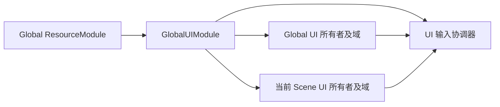

# UI 架构与公共契约

2026-09-09 首版实现契约。REQ-UI-001～019 已确认并落实为单个 GlobalUIModule、集中配置按需打开和 ISceneScopeLifecycle 自动接入。此前双模块提案已废弃；实际验证见 [实施与验收](./05_Implementation_And_Acceptance.md)。

## 1. 范围和依赖

首期基于已有 uGUI、TMP 和 UniTask，支持 Global/Scene、Overlay/Camera/World、Logic/View 分离、基础组件和 Layout。排除多实例面板、拖拽、折叠组、过渡动画和绑定代码生成。关闭缓存不等同于加载预热，也不要求自动建立所有面板实例。

根据用户审阅意见，改为只在 GlobalScope 安装一个 GlobalUIModule。之前的双 Module 方案废弃：Core 的具体类型唯一性不要求将受管 UI 的两种生命周期映射成两个 Module。



R→G 表示资源模块先加载；其他箭头表示拥有或使用。所有域由同一个 UI 模块管理，输入协调器是其内部服务，不再需要两个模块之间登记或依赖。Global/Scene 在此表达受管 UI 的生命周期和实例命名空间；它们不是额外的 Module。

GlobalUIModule 采用直接模块模式，运行记录由 UIContext 持有，呈现与输入分别交给 UIDomain 和 UIInputCoordinator；未另设 UIRuntime 或 UIModuleBase。Module SO 保存按 Global/Scene 所有者划分的域和面板模板，运行克隆创建新的容器、Logic 实例与资源记录。

场景所有者必须跟随 Ranger 实际执行的 SceneScope 轮次。正常活动场景替换会结束旧 SceneScope，即使旧场景仍以 Additive 存在；但新配置预检失败时 Runtime 会保留旧 Scope，UI 也必须保留旧所有者。不能只监听 Unity activeSceneChanged / sceneUnloaded 自行推断。

GlobalUIModule 卸载时清理所有受管对象。REQ-UI-007/011 中原先“所属 Scene 模块卸载”的清理要求，在单模块方案中落实为“SceneScope 所有者结束即清理”，不将场景面板改成常驻面板。

Runtime 直接依赖 Core Runtime、Resource Runtime、UniTask、uGUI/TMP 与项目既有 Odin 支持。UI 的本地生命周期和按钮回调不强制通过全局 Event 广播。列表同步首期保留相同 key 的现有条目并创建/销毁增减项，不等同于使用 Scene GameObjectPoolModule；不因“基础模块已有对象池”让 Global UI 反向依赖 Scene 池。额外池适配只在有实际需求时加入。

### 1.1 场景生命周期接入

除既有 FrameworkDriverHandlerBase 钩子外，Core 已按 REQ-UI-017 增加可选的 `ISceneScopeLifecycle` 能力接口，由已加载的 Global 模块实现，Runtime 自动收集并在固定位置调用。UI 实现该接口，不替换业务 Driver、不通过 EventModule 广播驱动关键清理、不新增 Scene 代理模块。开始、结束/回滚和预检失败保留语义已确认，下述签名与配对顺序为工程落实设计。

已实现接口：

```csharp
public interface ISceneScopeLifecycle
{
    UniTask OnSceneScopeStartingAsync(FrameworkSceneScopeInfo scope,
        CancellationToken cancellationToken);
    UniTask OnSceneScopeEndingAsync(FrameworkSceneScopeInfo scope);
}
```

`FrameworkSceneScopeInfo` 是 Runtime 创建的只读身份：Scene Handle、标准化场景路径与本次 Scope 轮次。轮次与 Runtime 实例身份共同区分同场景的重新装配；不暴露可修改的模块集合，也不开放 Global 向 Scene 查询模块。

固定顺序：

1. 新配置和模块图预检。失败沿用当前 Core 行为，保留旧 Scope，UI 不收到结束通知。
2. 若替换旧 Scope，停止旧 Scope Tick；在旧 Driver 的 BeforeScopeUnload 和 Scene 模块卸载之前，调用该轮参与者的 Ending。UI 此时拒绝新打开、取消在途请求、关闭并销毁场景面板与缓存、撤销该轮输入和场景绑定。单个异常被收集，后续清理继续。
3. 创建新 SceneScope 克隆和身份后，在 Driver 的 BeforeScopeLoad 和任何 Scene 模块 Load 之前，按 Global 已加载依赖顺序调用 Starting。UI 建立轻量场景上下文与配置表，按需创建呈现根；不等待 Framework.WhenReadyAsync，不自动打开全部面板。
4. Scene 模块开始加载，可以使用本轮 UI 上下文。若 Starting、Driver 或模块加载失败，先 Ending 再按现有流程回滚 Scene 模块；记录原始加载异常和附加清理异常。

Starting 在进入回调前记入该轮参与者集合，所以中途抛错的参与者也会收到一次 Ending。Ending 对这份集合逆序执行且每轮最多一次，不临时重新枚举或通知尚未开始的参与者。无 Scene 模块的空 Scope 同样获得生命周期；Shutdown 先结束 Scene，再卸载 Global。正常结束和失败回滚共享清理路径。

Starting 的 cancellationToken 只控制本次建立过程，不充当建立成功后的 UI 所有者存活令牌。Coordinator 可能在新配置预检前取消旧场景加载令牌；若 UI 直接用该令牌销毁已打开面板，会破坏“预检失败保留旧 Scope”的行为。建立后的 UI 请求使用自身所有者取消源，由 Ending 结束。

接口仅服务已加载 Global 模块，使用现有固定 Runtime 串行流程；回调不能发起并等待新的场景切换或 Shutdown，以免等待自身所在操作队列。不增加热安装、监听补发或可替换的 Scope 策略。正式决定见 [ADR-007](../../Core/ADR/ADR-007_Global_Module_Scene_Lifecycle.md)，补充既有固定 Runtime 和中央设置的契约。

## 2. 配置与呈现域

已确认（REQ-UI-016）首期由 GlobalUIModule 集中持有两组配置：Global 域/面板表、Scene 域/面板表。Scene 表是每个当前场景所有者可使用的定义集合，不代表自动打开；菜单场景只打开菜单，战斗场景只打开 HUD。资源仍在 OpenAsync 时按需加载，配置引用不会预加载所有 Prefab。

此组织不要求另建场景模块、不修改 FrameworkSceneConfig 的模块表语义。用户已选择集中目录；首期不引入按场景独立 UI 配置资产、自动选择目录及覆盖映射。

UIDomainDefinition 保存域 key、Canvas 模式、排序及缩放参数；Camera/World 使用运行时绑定，模板不引用场景对象。UIPanelDefinition 保存面板 key、域 key、层级、Prefab ResourceKey、Logic 模板、关闭策略、互斥组及模态范围。

生命周期由所属配置组确定，面板继承域所属的所有者，避免面板标记 Global、所在域却标记 Scene。配置表可以包含多个同渲染模式的域，例如 Global Overlay 的提示域与加载域；渲染模式不是域的唯一身份。每个面板配置普通并存或互斥及组 key，依附关系在 OpenChildAsync 调用时明确传入。

面板身份为 owner + panel key，与 Prefab 资源地址分离；同一地址可以被不同定义使用。owner 内域 key、面板 key 必须唯一且非空。面板引用的域必须存在；非空 MutexGroup 表示互斥，空值表示并存。配置错误在 Editor 与加载时通过共享校验器报告。

每个域拥有自己的 Canvas 根和排序容器。置顶只改变所属层内部顺序，不跨域、不跨层、不修改相机深度。多个 Overlay Canvas 的排序由配置明确；校验冲突，不依赖实例创建顺序猜测遮挡。

跨渲染模式的可见遮挡仍由 Canvas 模式、相机和世界深度决定；全局模态表示 UI 输入限制，并不承诺把 World 面板绘制在所有 Overlay 之上。全局加载遮罩示例使用明确排在其他 Overlay 之上的 Global 域。

Camera 域显式绑定相机；World 域显式绑定位姿目标及交互相机。UIDomainBinding 组件指明 Global/Scene 所有者与域 key，在 GlobalUIModule 和对应所有者可用后登记，在禁用/销毁时解除。候选组件须属于当前 Scope 的 Scene Handle，不能由旧 Additive 场景冒充。组件对象本身作为候选身份；禁用只移除该对象，旧对象迟到解绑不会清除新绑定。重复有效绑定需报告冲突，不静默抢占。

Global 实例保留在自身持久根下，World 目标只提供位姿，避免相机或挂载点所属场景销毁时带走 UI。绑定丢失时从渲染和输入参与者中撤下，清除借用引用，但保留面板打开状态、数据、Logic 和 Prefab lease。重绑定恢复，无额外 OnOpen。

Scene 自有根也由 UI 模块明确拥有并清理，不能依赖 Unity 销毁场景对象来完成 Logic/lease 释放。场景绑定组件可先于模块 OnEnable；由 UI 的绑定登记设施暂存候选，在模块及对应 Scope 身份有效时接入，OnDisable 移除候选。结束 SceneScope 时撤销该轮场景提供的绑定，包括借给 Global 域的绑定；持久对象提供的有效 Global 绑定不受影响。旧 Additive 场景不能重新绑定新轮次。绑定候选和对外上下文都不构成另一个 UI 管理模块。

首次或关闭后重新打开缺少必需绑定的 Camera/World 面板时，OpenAsync 报告明确失败，不调用 OnOpen、不登记已打开状态。加载前预检且提交前复检绑定；中途失去绑定清理半成品和 lease。已打开 Global 面板的失绑暂停/恢复与重复刷新继续遵守 REQ-UI-011/012。Overlay 不需要这种外部绑定。模块卸载统一销毁自己创建的对象，不销毁借用的相机或目标。

## 3. Logic、View 与公共操作

UIContext 的公共操作：

```csharp
UniTask<UIPanelHandle> OpenAsync(string panelKey, object data = null,
    CancellationToken cancellationToken = default);
bool TryGet(string panelKey, out UIPanelHandle panel);
void Refresh(UIPanelHandle panel, object data);
void BringToFront(UIPanelHandle panel);
void Close(UIPanelHandle panel);
void Close(string panelKey);
```

统一通过 `Framework.GetModule<GlobalUIModule>()` 获取模块。采用 `ui.Global` / `ui.Scene` 两个轻量上下文选择 owner，再调用上述 OpenAsync 等操作；它们不参与 Module 安装，不是另一个模块。Scene 上下文绑定具体 Scope 轮次，过期上下文不能作用于新场景；无有效 Scene 所有者时返回明确不可用结果。这样保留已确认的 owner + panel key 单实例规则，不将两种所有者的同名面板合并。无有效 Scene 时直接读取抛出 InvalidOperationException，TryGetScene 返回 false。面板内部使用注入的 UI 上下文，不通过全局 Current 猜测所有者。Prefab 加载只走已有 ResourceModule.AcquireAsync，后端由 ResourceKey 指定，不添加回退加载顺序。

使用示意：

```csharp
var ui = Framework.GetModule<GlobalUIModule>();
var loading = await ui.Global.OpenAsync("Loading");

var sceneUI = ui.Scene; // 捕获本轮上下文；后续 await 不重新猜测当前场景
var inventory = await sceneUI.OpenAsync("Inventory", inventoryData);
var confirm = await sceneUI.OpenChildAsync(inventory, "ConfirmDiscard", itemData);
sceneUI.Close(confirm);
ui.Global.Close(loading);
```

提供 `TryGetScene(out UIContext context)` 供场景过渡期探测；直接读取不可用的 Scene 上下文抛出明确状态异常。捕获的旧上下文不会转向新场景，Open/Refresh/BringToFront 的失效使用报错；Close 已结束轮次幂等，不误关新轮次。业务模块使用 ModuleContext 查询并声明 GlobalUIModule 依赖；静态 Framework 入口用于普通业务组件。Global 面板需要访问场景数据时由调用方传入或明确接线，UI 框架不绕过 Core 的模块查询方向。

UIView 负责 Prefab 组件引用和局部表现，UILogic<TView> 负责打开/关闭/刷新、业务事件接线与命令。Logic 由配置模板按实例创建，并绑定 View 和 owner；模板不得被拿来保存运行时 View 引用。允许默认 Logic 用于无专用业务的面板，不强制空的双类文件。

| 钩子 | 语义 |
| --- | --- |
| OnCreate | 新实例与 View 成功绑定后调用一次 |
| OnOpen(data) | 每次从关闭状态进入打开状态调用一次；用于本轮订阅和数据展示 |
| OnRefresh(data) | 显式刷新或重复 Open 已打开实例时处理新数据 |
| OnFocus / OnBlur | 有效输入焦点变化，不代替 Open/Close |
| OnClose | 本轮结束，负责解除本轮业务订阅 |
| OnDispose | 实例最终销毁，清理剩余引用及长期资源 |

重复 Open 复用唯一实例，执行 OnRefresh 并在允许的层内置顶，不重放 OnOpen。Close 已关闭面板幂等；Close 未知 key 可明确无操作，Open 未配置 key 报错。业务数据只保存本轮所需引用，关闭时清除框架所持数据，保留 View 内业务选择的显示状态不等同于保留整轮业务订阅。

UIPanelHandle 记录 owner、实例和打开轮次；Close/Refresh 等旧轮次操作不能误伤关闭后重开的实例。TryGet 对当前已打开实例返回当前轮次 handle。异步调用返回前必须再次核对所属轮次；资源准备取消或卸载不能返回失效成功结果。

## 4. 配置式关系与关闭联动

显示层级、关系策略和输入范围分开配置。普通面板可以并存；互斥面板按 owner + domain + group 确定替换范围。新面板资源及 View 校验通过后，再关闭旧互斥面板并打开新面板；准备失败保留旧 UI。普通面板开关不模仿 HTY Self 自动清掉整个域的依赖链。

**已确认的依附方向（REQ-UI-014）**：打开依附弹窗时明确指定父面板，而非绑定“当前焦点”或共享域内依赖链。已实现如下 handle 签名。

```csharp
UniTask<UIPanelHandle> OpenChildAsync(UIPanelHandle parent,
    string panelKey, object data = null,
    CancellationToken cancellationToken = default);
```

首期父子限制在同 owner、同域内，子面板 Layer 不低于父面板；依附关系是逻辑关系，不要求改变 Transform 父节点。父面板必须处于有效打开轮次。弹窗关闭后焦点恢复到仍可操作的父面板；关闭父面板从最深子项向父项关闭。单实例弹窗已依附 A 时不能被 B 静默接管，返回明确冲突。销毁/回调重入期间不允许形成循环依附。

模态与依附正交：普通依附信息框可以不阻断父面板，模态依附弹窗可阻断指定范围。导航返回栈不是首期要求，关闭弹窗的焦点恢复也不意味着框架维护任意页面历史。

## 5. 输入与焦点

UIInputCoordinator 汇总当前有呈现能力的模态面板。Domain 范围只限制同域目标，Global 范围限制所有向协调器注册的 Global/Scene UI 域。当前有效模态与其允许操作的上层依附弹窗不被自己的限制挡住；嵌套关闭后重新计算，不用简单计数器恢复所有面板。

输入判定采用确定顺序：有效 Global 模态优先，其后处理每域有效模态；同范围的后进入模态优先，子模态在依附链内优先。被 Global 模态挡住的其他域内模态不反过来阻断当前全局弹窗。恢复时只恢复框架施加的限制，不把业务自己禁用的按钮强行启用。

指针射线与 Selectable 交互、EventSystem 当前选择都要协作处理。失效选择先清除，关闭顶层弹窗后只恢复有效、可交互的原目标。View 内绕开所属面板限制的嵌套 override Canvas / ignoreParentGroups 配置需要校验，不能仅靠焦点 bool 宣称阻断成功。

暂停呈现的域不施加模态限制；重新呈现后重新参与协调。模块卸载必须注销所有参与者。输入范围只覆盖受管 UI，不修改 Time.timeScale、不调用角色输入模块，也不拦截业务直接调用的普通方法。

## 6. 异步与资源生命周期

每个 owner/key 最多一份在途资源准备和一份实例。相同 key 并发请求共享物化，不重复 Instantiate；各等待者取消只撤销自己的等待。全部等待者取消或 Close/Unload 作废该操作；底层迟到 lease 必须释放。准备完成后按请求顺序处理尚有效的数据请求：首次 OnOpen，后续 OnRefresh，取消项不刷新。不得将只能等待一次的 UniTask 实例直接暴露给多个等待者。

关闭策略：KeepAlive 执行本轮 OnClose 后隐藏并保留 View、Logic 与 Prefab lease；DestroyOnClose 额外 Dispose、销毁实例并释放资源。卸载先拒绝新操作、取消在途请求，逆序关闭依附关系、解除输入登记与布局请求，销毁缓存及根，最后释放持有资源。Unity Destroy 的延迟销毁与后端释放顺序需要在实现中验证，不能让仍活着的实例借用已被提前卸载的资源。

Close 的同步返回表示逻辑关闭、禁止输入并发起销毁；如果 Unity 实例需要帧末才实际销毁，lease 转入 UI 持有的待释放集合，在实例销毁后释放。异步 Scope 结束与模块卸载等待该集合清理完成，资源模块随后才可卸载；不能把任务无所有者地 Forget 后提前释放资源。

准备和 OnCreate 失败清理半成品；OnOpen 失败终止失败面板轮次并清理已建立的订阅，不能伪装成功。旧互斥面板在新 OnOpen 前已正常关闭时，不承诺自动重放旧业务回调回滚。OnRefresh 失败报告给当前调用者，保留已存在实例。关闭/Dispose 中单个回调异常记录后继续清理其他对象，最终汇报实际失败。

## 7. 组件、列表与 Layout

基础组件用 uGUI/TMP 组合或适当派生，不禁止原生 Image/TMP。UIButton 区分点击和长按：有效指针按下并在可交互区域内完成抬起才点击，长按完成后不再补一次点击；禁用、失焦或失去呈现会结束按压。键盘 Submit 走单次点击，不模拟指针长按。

切换组保持可配置的单选约束，支持不发通知的程序刷新；选中变化不能因重复设置同值无限互调。滚动工具在布局结算后计算目标边界，以内容不足、目标已销毁、水平/垂直模式和保持当前位置为边界验证，首期不做动画滚动和虚拟列表。

UIListController<TKey,TData,TView> 按稳定 key 同步条目。先验证重复 key，再修改层级；保留项刷新、新增项绑定、删除项解绑销毁，顺序匹配输入。Clear/Dispose 只清理由该控制器拥有的条目，不能扫除父节点下用户手放的对象。模板来自 View 的序列化引用，生命周期由 View/面板资源覆盖；若单独 Acquire 模板则控制器明确持有并释放对应 lease。

布局包含 Horizontal/Vertical、固定列 Grid、内容适配与忽略项。统一 MarkDirty、BeginBatch/Dispose、FlushNow；普通更新合并到统一刷新时点。布局算法区分水平测量/分配与垂直测量/分配，保证文本获得宽度后再测换行高度。优先复用 uGUI 的布局协作接口承载自定义组件，避免另建与 Canvas 完全脱节的绘制循环。

同一轴只有一个布局控制者；冲突在 Editor 报告。更新期间新脏请求进入后续批次，不在清队列时丢失；FlushNow 不无限递归，首期不另建布局振荡诊断系统。无脏变更时不扫描整棵树。独立组件和编辑器预览不依赖已经加载的 UI 模块，运行时调度拥有明确的注册/释放入口。

调度层负责合并和提交根，几何计算仍由同一套 uGUI 布局接口执行：常规刷新提交 LayoutRebuilder，显式 FlushNow 只结算相关布局根。重建过程中再次请求 Flush 不递归启动另一轮；记录待处理请求并在后续安全时点处理。避免“每帧自定义全树布局，再让 Canvas 重做同一棵树”的双重常规调度，也不把 Canvas.ForceUpdateCanvases 作为所有工具的默认实现。不会承诺屏蔽原生组件自身的全部脏标记。

典型链路是：列表批量同步 → 根标脏合并 → 测量/分配宽度 → TMP 得到换行高度 → 测量/分配高度 → 滚动工具读取最终条目边界。同轴父布局控制尺寸与子自适应写尺寸冲突需明确诊断；同一树内合法的嵌套自适应仍须支持。

## 8. Editor、样例与交付限制

Framework Center 中提供 UI 配置/Prefab 骨架创建、配置与引用诊断以及运行只读检查。创建操作保留既有资产，不覆盖用户业务 Logic/View 文件；手动拖拽字段，缺失引用显示具体路径。配置校验复用 Runtime 校验器，Editor 才使用 UnityEditor API。

独立样例至少覆盖 Global Overlay 提示、Scene Overlay 面板关系、Camera 域、World 域、双场景重绑定、动态文字/列表/滚动。样例配置追加接入现有设置，避免重写其他模块验收场景。

Runtime、Editor、Samples 与聚焦 Tests 已实现。实际通过记录与限制见 [实施与验收](./05_Implementation_And_Acceptance.md)，使用步骤见 [模块 README](../../../../BaseModules/UI/README.md)。

