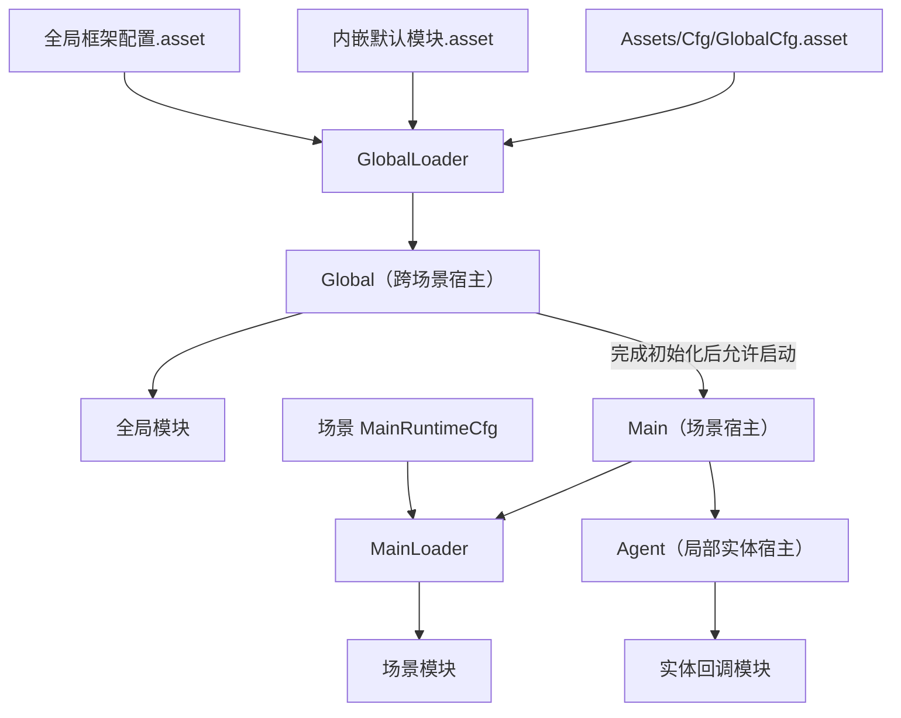
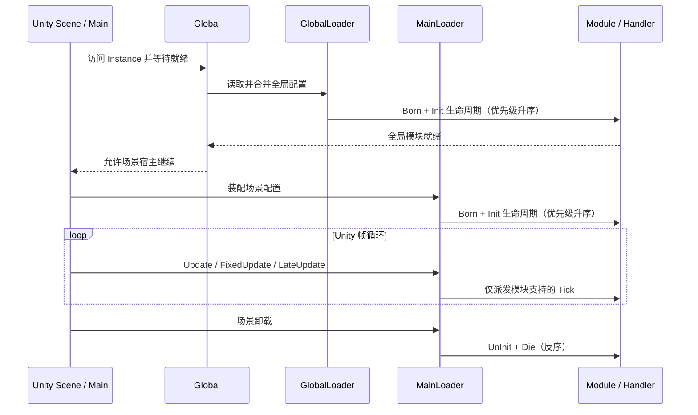

# HTY / ActFramework 参考架构

> 参考项目：`D:\unityhub\UnityProjects\LyingBottle`<br>
> 检查日期：2026-08-06<br>
> 参考定位：LyingBottle 是使用 HTY / ActFramework 的真实游戏项目；框架源码与游戏装配、调用点可以交叉验证。<br>
> 用途：为 Framework_WWJ 从零重建设立事实基线，不代表目标框架必须兼容或复刻 HTY API。

## 1. 信息标记

- **事实**：已从参考项目代码、Unity 资产或项目文档中交叉确认。
- **推断**：根据多处实现归纳出的设计意图，后续仍可继续验证。
- **候选**：值得在 Framework_WWJ 中讨论的方向，尚未成为决策。
- **决策**：由 Framework_WWJ 后续设计阶段明确确认的结论。本文当前不记录新架构决策。

## 2. 规模快照

| 项目 | 结果 | 统计口径 |
| --- | ---: | --- |
| C# 文件 | 3,150 | `Assets/Plugins/ActFramework_ByHZR` 全目录，包含内置工具和第三方源码 |
| asmdef | 183 | 同上，包含 Runtime、Editor、Util、RuntimeModule 与第三方程序集 |
| LyingBottle 全局模块项 | 26 | `Assets/Cfg/GlobalCfg.asset` 中的 `moduleItemCfgs` |

这些数字解释了 HTY 的重量，但不能直接代表其“模块骨架”本身的必要规模。C# 文件主要分布在 Util、BuiltInTools、Main、RuntimeModule、CustomUI 和 MainCore；顶层 `ActFramework.Packages.asmdef` 又聚合了大量运行时模块、工具和第三方依赖。

## 3. 总体结构

**事实：** HTY 的核心执行模型是宿主驱动模块。`Global` 管理跨场景生命周期，`Main` 管理当前场景生命周期；两者都通过 Loader 装配、索引和驱动模块。`Agent` 是更局部的业务实体载体，会把碰撞、触发器等回调转发给其模块。



### 3.1 Global

- **事实：** `Global` 是常驻宿主，通过 `DontDestroyOnLoad` 跨场景存在。
- **事实：** 访问 `Global.Instance` 会触发其创建/唤醒路径；`GlobalLoader` 从 Resources 中读取框架级配置，并组合内嵌配置、项目全局配置和可选配置套件。
- **事实：** Global 模块完成初始化后，场景 `Main` 才继续加载。
- **候选：** Framework_WWJ 是否需要跨场景宿主，必须由第一个游戏目标的场景模型决定。

### 3.2 Main

- **事实：** `Main` 是场景组件，每个场景可以拥有自己的模块配置与 Loader。
- **事实：** 它等待 Global 就绪，然后初始化场景模块；场景卸载时反初始化场景模块并清理相关协程。
- **事实：** Main 销毁不会销毁 Global 模块。
- **候选：** 场景宿主是否直接承接 Unity 生命周期，或只负责驱动一个纯 C# Runtime，尚未决定。

### 3.3 Agent

- **事实：** Agent 用于更局部的实体生命周期和 Unity 回调转发，不是每个游戏框架都必需的核心层。
- **候选：** Framework_WWJ 初期更适合把它视为未来业务扩展，而不是基础骨架必备能力。

## 4. 模块与 Handler

| 类型 | 实现载体 | 典型用途 | 生命周期归属 |
| --- | --- | --- | --- |
| External 模块 | `GeneralSO` / ScriptableObject | 可资产化、可配置的模块模板 | 注册时实例化，由宿主驱动 |
| Internal 模块 | `GeneralBehaviour` / MonoBehaviour | 已存在于场景中的组件模块 | 随场景对象存在，由宿主驱动 |
| Handler | 实现 `IModuleHandler` 的对象 | 将模块门面与具体逻辑解耦 | 接收模块生命周期和 Tick 转发 |

**事实：** `IModule` 由生命周期、更新和暂停能力组合而成；Handler 也有对应组合接口，并可选支持加载进度和 LateUpdate。External 与 Internal 基类最终都委托 `ModuleLifecycleHelper` 推进状态。

**推断：** “模块门面 + Handler”主要解决 Inspector/资产入口与可替换逻辑之间的分离，但在简单模块中会增加类型和转发层。Framework_WWJ 后续应把 Handler 视为待验证的组合方式，而不是所有模块的强制结构。

## 5. 配置与装配

### 5.1 配置层次

- **事实：** `ModuleCfg` 保存模块项、静态配置数据 `cfgDatas`、动态配置相关数据和 Odin 单例唤醒项。
- **事实：** `MainRuntimeCfg` 可以包含本地模块项，并递归组合其他配置包。
- **事实：** `GlobalCfg` 指向内嵌运行时配置和项目全局运行时配置，还可组合自定义配置套件。
- **事实：** 模块项拥有字符串 key、模块引用、启用开关和预览信息；执行优先级存放在模块实例本身。

### 5.2 装配行为

- Loader 合并启用模块并按较小的 `priority` 优先初始化。
- External ScriptableObject 模块以配置资产为模板，在注册阶段实例化运行时副本。
- Loader 建立 key、类型等索引，并预分类 LateUpdate、OnGUI 等可选能力列表。
- 宿主已完成初始化后动态加入模块时，新模块会立即进入初始化路径。
- 卸载按反向顺序推进，以降低依赖模块先于被依赖模块销毁的风险。

递归配置、动态模块、热配置占位和唤醒项共同提高了扩展性，也显著增加了配置来源、所有权和调试复杂度。

## 6. 生命周期与时序

**事实：** 完整模块生命周期为：

```text
Born
  -> BeginInit -> Init -> EndInit
  -> Run / Pause / Update / FixedUpdate / LateUpdate
  -> BeginUnInit -> UnInit -> EndUnInit
  -> Die
```

**事实：** `ModuleLifecycleHelper` 管理生命周期状态；Loader 负责按序调用。生命周期阶段较多，并同时存在 loading、running、pause 等状态维度。



## 7. 场景切换

- **事实：** `SceneLoader` 统一场景加载、卸载、进度与回调，并保留 Addressables 扩展入口。
- **事实：** 为避免场景栈短暂无有效场景，切换过程会使用临时 additive 场景。
- **事实：** 旧场景卸载前，会先等待对应 Main 完成模块卸载。
- **事实：** Global 会接收场景加载前后回调，Global 模块不随普通场景切换销毁。

这套流程覆盖了大型项目的加载 UI、跨场景服务和回调需求；轻量框架是否需要接管完整场景加载，要由真实游戏流程验证。

## 8. LyingBottle 全局模块快照

`Assets/Cfg/GlobalCfg.asset` 当前包含 26 个模块项，其中 PreviewCamera、PerformanceOverlay 和 MainBottle 默认关闭，其余默认开启：

| 默认开启 | 默认关闭 |
| --- | --- |
| GameStateManager、WindowManager、CommandManager、FileSaveManager、DebugLoggerManager、CameraRenderControlManager | PreviewCameraManager |
| LocalizationManager、NumericalResourcesManager、ViceBottleManager、ViceBottleCharacterManager、ViceBottleAIManager | PerformanceOverlayManager |
| LotteryManager、SafeManager、PlatformManager、ViceInputManager、GmBridgeLifecycle、CloudSaveSyncManager | MainBottleManager |
| AchievementManager、LyingBottleServiceSyncManager、RenderQualityControlManager、SoundsManager、CloneManager、WeatherAndTimeManager |  |

这些是 LyingBottle 的游戏需求快照，不是通用框架的基础模块清单。

## 9. 已验证的复杂度风险

- `ActFramework.Main` 直接依赖 Input System、Addressables、DOTween、Odin、Newtonsoft.Json、UI 等能力，核心边界较宽。
- 顶层 `ActFramework.Packages` 聚合大量 RuntimeModule、Util 和第三方程序集，形成明显的编译与认知负担。
- 多阶段生命周期在异常、重入和部分初始化失败时需要更严格的状态与回滚保证。
- 运行时动态增删、递归配置、热配置占位和多种查询索引提高了维护成本。
- 项目评审文档还记录了多种单例并存、EventHub 全局锁、对象池缓存释放、Blackboard 并发等问题；这些属于 HTY 当前实现风险，不应被新框架继承。

## 10. 对 Framework_WWJ 的意义

HTY 已证明“宿主统一驱动模块”能够支撑大型 Unity 项目；它也证明了可选能力如果全部进入核心，会让骨架迅速变重。Framework_WWJ 下一步应复用问题定义和测试场景，而不是复用全部 API。具体取舍见 [HTY 轻量化提炼矩阵](./07_HTY_Lightweight_Extraction_Matrix.md)。
