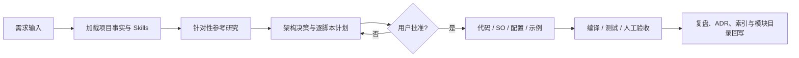

# Framework_WWJ AI 模块开发流水线

> 状态：基础模块及后续正式模块的统一工作流。  
> 自动发现 Skill：`$build-framework-wwj-module`。  
> 前置 Skill：`$work-with-framework-wwj`；涉及核心契约时同时使用 `$framework-wwj-lightweight-refactor`。

## 1. 流水线目标

用户提供模块功能需求、实现思路或参考代码后，AI 应能稳定完成以下闭环：



## 2. 阶段 0：事实加载与任务分类

每次开始模块任务时：

1. 读取 Docs 总索引、当前项目状态、本目录 README、核心 ADR 和重建设计待办。
2. 检查 Git 状态，识别并保留用户的场景、配置、Package 和其他未提交改动。
3. 判断当前请求属于：需求整理、参考研究、正式设计、已批准实现、验收/修复中的哪一种。
4. 不把“讨论一个模块”解释为“立即生成全部代码”。

## 3. 阶段 1：模块需求简报

在正式计划前记录：

- 模块解决的开发问题和可观察结果；
- 首批调用方与真实游戏场景；
- 必须支持、明确不支持、可延后的能力；
- Global/Scene 作用域与运行实例数量；
- 公开 API 草案与调用示例；
- 同步/异步、取消、失败、重试和释放语义；
- 与现有 Module、Handler、Framework Center 和其他模块的依赖；
- 性能、GC、内存、平台与第三方包约束；
- EditMode、PlayMode 和人工示例验收目标。

缺失信息如果会改变公共契约，应继续向用户提问；可以安全延后的内容进入 Backlog。

## 4. 阶段 2：针对性参考研究

### LyingBottle / HTY

先遵守 LyingBottle 的 `AGENTS.md` 与项目 Skills。LyingBottle 是 HTY 的真实使用项目，应同时观察：

- HTY 模块自身的接口、Manager/Handler/配置与生命周期；
- `Assets/Cfg/GlobalCfg.asset` 和模块 SO 的真实装配；
- LyingBottle 业务代码如何调用和清理该能力；
- 项目评审中已记录的复杂度、缓存和全局状态风险。

### YokiFrame

先读取其 Kit、CLI、Workbench Skills 及对应模块文档。重点观察独立能力、所有权、Provider/Handle、适配层和安装工作流。

研究输出必须标记为事实、推断、候选或已确认决策，并写明源码路径。参考项目保持只读，不默认复制 API。

## 5. 阶段 3：模块架构与计划

正式计划必须至少包含：

1. 目标、范围、非目标与已确认决策；
2. 代码逻辑层次图、关键数据流和生命周期时序图；
3. 目标目录树与程序集依赖；
4. 逐脚本说明：属性、公开/受保护方法、内部状态、实现方式与协作关系；
5. SO 模板、配置资产、中央设置和示例接线；
6. 失败、取消、重复、Shutdown、Domain Reload 和资产不脏写规则；
7. Editor Center 页面或 Inspector 的必要性与最小功能；
8. EditMode、PlayMode、示例场景和性能验收；
9. 实施门禁、迁移影响、文档回写和明确不做的扩展。

计划中的每个生产程序集必须同时声明其 `FrameworkArchitectureAssemblyAttribute` 分组路径；逐脚本表中的顶层类、接口、结构体和枚举必须给出中文职责与关键协作关系。Tests、Samples 和第三方程序集不为满足架构图而接入生产目录。

影响多个模块或未来分发边界的选择必须写 ADR。计划经过用户批准前不创建 Runtime 模块代码。

## 6. 阶段 4：Skill 与交付物准备

- 始终使用统一的 `$build-framework-wwj-module` 流水线 Skill。
- 先搜索是否已有该模块的专用 Skill 或项目文档。
- 只有当模块存在会重复执行、难以从通用流程推导的操作（例如新增资源 Provider、生成内容目录或执行专门验证）时，才用 `$skill-creator` 创建模块专用个人 Skill。
- 架构事实放在项目 Docs；个人 Skill 只路由和执行，避免两份事实源漂移。
- 不因为每个模块有一个名称，就机械地创建一个空壳 Skill。

## 7. 阶段 5：已批准实现

按计划逐门禁实施：

1. 建立程序集与空类型，声明生产程序集架构分组，先确认依赖方向可编译；
2. 实现纯契约和纯算法，优先通过 EditMode；
3. 接入 Module/Handler、Scope 生命周期、失败回滚与 Shutdown；
4. 创建 SO 模板和配置资产，使用既有中央设置与依赖图完成装配；
5. 添加必要 Inspector、Framework Center 页面或运行时诊断；
6. 建立最小示例，证明模块在真实 Unity 生命周期中可用；
7. 执行完整回归，修复后再进入文档收尾。

任何生产顶层类型在实现时都必须维护 `FrameworkArchitectureAttribute`。模块完成前应能从 Framework Center 根目录逐层进入模块，查看职责、依赖并定位到正确源码；不得等到验收文档阶段才补一个孤立的 Module 节点。

代码继续遵守中文 XML 注释、解释“为什么”的中文注释、语义化 `#region`、私有序列化字段和公开只读属性规范。不为假想需求堆叠保护或抽象。

## 8. 阶段 6：验证阶梯

```text
静态结构与链接
  -> Unity 程序集编译
  -> 模块 EditMode
  -> 模块 PlayMode
  -> 全框架 EditMode / PlayMode 回归
  -> 示例场景人工验收
  -> 资产、克隆、订阅、句柄和池对象泄漏检查
```

验证失败时停在当前层；不得只因代码生成完毕就宣称模块完成。无法运行 Unity 时，必须明确列出未验证项。

## 9. 阶段 7：收尾与可分发信息

完成后更新：

- 模块 README、ADR、实施计划、验收复盘；
- Docs 总索引、当前项目状态和决策待办；
- 模块依赖图、程序集分组 Attribute、全部生产类型 Attribute 与源码定位；
- Skill 路由与必要的模块专用参考；
- 未来分发所需的模块身份、程序集、依赖、资产与安装边界候选。

只有代码、资产、配置、测试、示例和文档同时达到批准的验收标准，模块阶段才关闭。

## 10. 三项场景检查

### 只有研究请求

只整理事实、候选和问题，不创建模块代码或配置资产。

### 只有设计请求

先获得目标、范围、非目标和验收标准；输出详细计划并等待批准。

### 已批准实现请求

只修改 Framework_Test 中批准的模块范围。LyingBottle 和 YokiFrame 保持只读；用户未授权的 Packages、ProjectSettings 和场景改动不进入范围。
