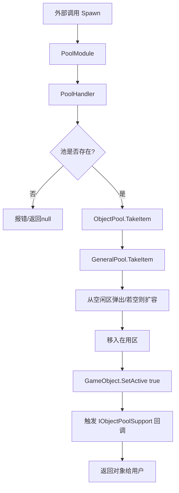

# Framework_WWJ 对象池系统技术文档

本系统是参考 `ActFramework_ByHZR` 深度复刻并优化的高性能对象池解决方案。它采用了表现与逻辑分离的 **Manager-Handler** 架构，并针对 Unity 环境下的 `GameObject` 操作进行了多项性能优化。

---

## 1. 系统架构 (Architecture)

系统采用三层架构，确保了逻辑的解耦与高度的可维护性：

### 1.1 表现层 (Module/Manager)
- **PoolModule**: 继承自 `HandlerModuleBase<IPoolHandler>`。
- **职责**: 框架的唯一访问入口（单例 `Instance`），负责接入框架生命周期，将所有 API 调用转发给逻辑层。

### 1.2 逻辑层 (Handler)
- **PoolHandler**: 实现 `IPoolHandler` 接口。
- **职责**: 维护 `池名 -> ObjectPool` 字典；处理分帧加载（缓加载）队列；管理自动缩减计时器。

### 1.3 核心池层 (Core Pool)
- **ObjectPool**: 针对 `GameObject` 的特定封装。处理实例化、父节点管理、`SetActive` 状态切换以及组件回调缓存。
- **GeneralPool<T>**: 纯 C# 编写的底层通用池。负责最基础的空闲/在用列表管理。

---

## 2. 核心功能 (Features)

### 2.1 表现与逻辑分离 (Manager-Handler)
利用 `HandlerModuleBase` 基类，将复杂的对象池管理逻辑从 `MonoBehaviour` 中抽离。这使得逻辑类（Handler）可以更方便地进行序列化、数据驱动，并减少了场景中组件的负担。

### 2.2 缓加载 (Slow Prepare / 分帧预热)
为了防止在游戏开始或切换场景时由于瞬间实例化大量对象（`Instantiate`）导致的掉帧，系统支持缓加载：
- 在 `PoolHandler.Update` 中按配置的 `m_maxSpawnPerFrame` 数量逐帧创建对象，直到达到预热目标。

### 2.3 自动缩减 (Auto Reduction)
系统会监控每个池的闲置状态：
- 当一个池完全处于“全空闲”状态时开始计时。
- 达到 `autoReductionTime` 后，自动销毁超出“初始预热量”的冗余对象，释放内存。

### 2.4 数据驱动配置 (SO-Based Config)
- **ObjectPoolCfg**: 通过 `ScriptableObject` 统一配置所有池的模板、预热数、步长等。
- **编辑器集成**: 在框架 APP 中心提供专门的 `Pool Manager` 页面，支持一键创建配置、搜索编辑以及数据清理。

---

## 3. 技术要点与性能优化 (Technical Highlights)

### 3.1 O(1) 复杂度的回收 (Swap-Remove)
在 `GeneralPool<T>` 中，回收对象不再使用 $O(n)$ 的 `List.Remove()`，而是采用 **Swap-Remove** 技术：
- 将在用列表（`m_useList`）的最后一个元素移动到被回收元素的位置，然后直接删除末尾。这使得在大规模池操作下，回收效率极高且稳定。

### 3.2 IPoolIndexable 优化
支持接口 `IPoolIndexable`。若对象实现该接口，回收时可直接通过其缓存的索引进行定位，彻底绕过字典（Dictionary）查找，实现零哈希开销的极致回收。

### 3.3 组件回调缓存 (Component Callback Caching)
在 `ObjectPool` 中，克隆体诞生时会一次性扫描并缓存所有实现了 `IObjectPoolSupport` 的组件：
- **Spawn/Despawn** 时直接遍历缓存数组，避免了高频调用 Unity 原生 `GetComponent` 带来的堆内存分配与 CPU 消耗。

### 3.4 零物理闪烁 (Safe Spawn Position)
新创建的对象会先被放置在远处的 `SPAWN_POSITION (5000, 5000, 5000)`，在完成 `SetActive(true)` 和位置重置后再显示，有效防止了实例化瞬间在摄像机前“闪烁”的现象。

---

## 4. 生命周期流转图

---

## 5. 使用建议

1. **预热设置**: 对于子弹、特效等高频对象，务必设置合理的 `prepareCount`。
2. **回调接口**: 在对象脚本中实现 `IObjectPoolSupport` 来重置状态，而不是使用 `OnEnable/OnDisable`（因为池化对象的激活时机由系统统一精准控制）。
3. **分帧控制**: 如果项目对加载速度敏感，可以调高 `m_maxSpawnPerFrame`；若追求极致平滑，则保持较小值。
