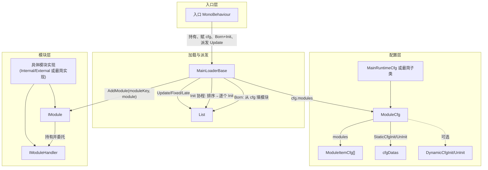

根据对 Packages/Main 的梳理，下面是一份只做“统一加载、卸载、管理模块”的最小骨架说明：哪些脚本必要、哪些可删、以及最小可运行集。

------

## 一、目标：最小可运行“骨架”

只做三件事：

- 加载：按配置/代码把模块加入管理器并执行 Init

- 卸载：反初始化并移除

- 管理：按优先级排序、Update/FixedUpdate/LateUpdate 派发、按 key 或类型查找、Pause/Run

下面按“必要 / 可精简 / 可去掉”分类。

------

## 二、必要脚本（核心契约 + 管理器）

| 脚本                        | 作用                                                         |
| :-------------------------- | :----------------------------------------------------------- |
| Core/IModule.cs             | 模块契约：Born/Die、Init/UnInit、Update/FixedUpdate、priority、isLoading 等。 |
| Core/IModuleHandler.cs      | 处理器契约（驱动一个模块）+ IModuleHandlerLateUpdateSupport（LateUpdate）。Loader 本身也是 IModuleHandler。 |
| IMainLoader.cs              | 继承 IModuleHandler + LateUpdate，作为“主 Loader”的类型，供 Main/Global 等使用。 |
| MainLoaderBase.cs           | 核心：维护 List<IModule> + 字典、从 cfg 填模块、排序、Init/UnInit 协程、Update/FixedUpdate/LateUpdate 派发、AddModule/RemoveModule/Pause/Run/GetModule。 |
| Main.cs 里的 ModuleComparer | 按 IModule.priority 排序，Init 前必须用。可单独拆成 ModuleComparer.cs。 |

没有这些，就没有“模块 + 管理器”的完整闭环。

------

## 三、配置层：必要但可做“最小实现”

| 脚本                           | 作用                                                         | 是否必须                                                     |
| :----------------------------- | :----------------------------------------------------------- | :----------------------------------------------------------- |
| ModuleCfg（Core/ModuleCfg.cs） | 提供 modules（List<ModuleItemCfg>）及 StaticCfgInit/UnInit、DynamicCfg 等。 | 要保留，但可做最小版：只保留 modules 的 getter，StaticCfg/DynamicCfg 可空实现或去掉。 |
| ModuleItemCfg                  | 一条配置：moduleKey、module（IModule）、on。                 | 必要，在 MainRuntimeCfg.cs 里。                              |
| MainRuntimeCfg.cs              | 继承 ModuleCfg，实现 modules 的 get（从 moduleItemCfgs ± 包合并）。 | 若你只有“一个列表”的配置，可以只要一个最简 ModuleCfg 子类（只暴露一个 List<ModuleItemCfg>），不必保留多包合并逻辑。 |
| ModuleCfg.partial.cs           | 编辑器里清缓存、PlayMode 切换。                              | 骨架可不要，或只保留 InvalidateCfgCache 的调用点。           |

也就是说：配置层必要的是“能提供 List<ModuleItemCfg> 的 ModuleCfg + ModuleItemCfg”，其余（静态/动态 SO、多包）都可视为扩展。

------

## 四、入口与场景生命周期（二选一或简化）

| 脚本                | 作用                                                         | 对“最小骨架”的建议                                           |
| :------------------ | :----------------------------------------------------------- | :----------------------------------------------------------- |
| Main.cs             | 场景级入口，继承 BasicOdinGameManager<Main, IMainLoader>，持有 MainLoader，驱动 Init/Update 等。 | 依赖 BasicOdinGameManager（不在当前仓库）。最小骨架可不用 Main，改成一个简单 MonoBehaviour：挂一个 MainLoaderBase、在 Start 里 Born+Init、在 Update/FixedUpdate/LateUpdate 里调 loader。 |
| Global.cs           | DontDestroyOnLoad 单例，提供 Global.Instance.StartCoroutine、当前 Main 列表等。 | MainLoaderBase 的 Init 用 Global.Instance.StartCoroutine(InitLife())。最小骨架可改为：用你自己的 MonoBehaviour（例如上述简单入口）做协程宿主，把 Global.Instance 换成 this 或传入的 MonoBehaviour。 |
| GlobalModuleBase.cs | Global 的基类，单例 + 处理器创建 + 生命周期。                | 只有在你保留 Global 做入口时才需要；若用“简单 MonoBehaviour + MainLoaderBase”则可不要。 |
| MainLoader.cs       | 继承 MainLoaderBase，在场景卸载时 UnInit、StopAllCoroutines。 | 若不做场景切换时的卸载，骨架可直接用 MainLoaderBase，不要 MainLoader。 |
| MainSetting.cs      | 仅 UnInitImmediately。                                       | 骨架可写死 true/false 或内联，可删。                         |

结论：最小骨架不必依赖 Global + Main + BasicOdinGameManager，只要有一个能挂 MainLoaderBase、能跑协程的 MonoBehaviour 即可。

------

## 五、与“模块管理”无直接关系的（可视为多余或后期加）

- Agent、AgentLoader、AgentPartial：Agent 体系，与“模块的加载/卸载/管理”无关，骨架可不要。

- EventHandler/（如 MainFinishLoadEventHandler、GlobalFinishLoadEventHandler）：事件总线的扩展，骨架可不要。

- HtyScene/SceneLoader：场景加载与事件。MainLoaderBase 里只用来订阅场景开始/结束。骨架可以：不订阅 SceneLoader，或提供一个空实现/空事件，这样不依赖 SceneLoader。

- UI/MainLoadingUI、MainLoadingUICfg：加载进度 UI，骨架可不要。

- Version/：版本、构建、工具栏，骨架可不要。

- MainTickToolKit、EventHub、DelayGlobalInit 等：延迟执行与事件，骨架可不要。

- Editor/ 下所有：编辑器增强，骨架不必带。

- Util/（TimeControl、CoroutineGuard、FunctionInjection 等）：非“模块管理”核心，骨架可不要。

- Support/ExtraSupport.cs（IModuleGUISupport、IGizmoSupport、IModuleLateUpdateSupport）：扩展接口；IModuleLateUpdateSupport 在 MainLoaderBase.LateUpdate 里用到，若保留 LateUpdate 派发则保留该接口即可，Gizmo/GUI 可不要。

------

## 六、模块实现侧（至少保留一种）

要“可运行”，至少要有一个模块实现和一种配置方式：

- InternalModuleBase + InternalBasicModule（场景里挂的 MonoBehaviour 模块），或

- ExternalModuleBase（SO 模块）

以及一个简单配置：一个继承 ModuleCfg 的类，只提供 List<ModuleItemCfg> modules。

这些依赖 GeneralSO、GeneralBehaviour、Odin、BasicUtil 等；若你做“自己的框架”，可以自己实现最简的 Module 基类（实现 IModule + 一个 IModuleHandler），不一定要照抄 InternalModuleBase 整条继承链。

------

## 七、外部依赖（若保留现有实现）

MainLoaderBase 当前依赖：

- ActFramework_ByHZR.BasicUtil：FastDictionary、SafeAddRange、IsEmpty、GuidSpawner、ConsoleLogger 等。

- ActFramework_ByHZR.MainLoop.HtyScene：SceneLoader。

- ActFramework_ByHZR.Constant：CommonConstant 等。

- ActFramework_ByHZR.Terminal：TerminalLogEventHandler。

- Sirenix.OdinInspector / Serialization：序列化与 Inspector。

做最小骨架时，可以：

- 用 Dictionary 替代 FastDictionary；

- 用 List 的 null/Count 替代 IsEmpty、SafeAddRange；

- 用 System.Guid.NewGuid().ToString() 替代 GuidSpawner；

- 场景事件不订阅或写空实现，去掉对 SceneLoader 的依赖；

- 用 Debug.LogError 替代 ConsoleLogger/Terminal；

- 若去掉 Odin，则 ModuleCfg/MainRuntimeCfg 用 [SerializeField] 等普通序列化。

------

## 八、最小可运行骨架的文件清单（建议）

只做“统一加载、卸载、管理模块”时，最小集可以是：

1. Core/IModule.cs

1. Core/IModuleHandler.cs（含 IModuleHandlerLateUpdateSupport）

1. IMainLoader.cs

1. Core/ModuleCfg.cs（可剪成只保留 virtual List<ModuleItemCfg> modules 和空 StaticCfg/DynamicCfg）

1. ModuleItemCfg（可从 MainRuntimeCfg.cs 拆出到单独文件或放在 ModuleCfg.cs）

1. MainLoaderBase.cs（并改成：协程宿主由参数/静态入口传入，SceneLoader 改为可选或空实现，字典用 Dictionary，其它工具用最小实现替代）

1. ModuleComparer（可从 Main.cs 拆到 ModuleComparer.cs）

1. 一个“最小 ModuleCfg”实现：例如只含 List<ModuleItemCfg> moduleItemCfgs 的 ScriptableObject，实现 modules => moduleItemCfgs。

1. 一个“入口”MonoBehaviour：创建/持有 MainLoaderBase，赋 cfg，在 Start 里 Born + Init（用本 MonoBehaviour 的 StartCoroutine），在 Update/FixedUpdate/LateUpdate 里调 loader 的 Update/FixedUpdate/LateUpdate。

1. 一个最简 IModule 实现（例如一个继承 MonoBehaviour 的类实现 IModule + 对应 IModuleHandler），用于测试。

可以不放进骨架的：

- Main.cs、Global.cs、GlobalModuleBase、GlobalLoader、MainLoader、MainSetting

- MainRuntimeCfg 的“多包合并”、ModuleCfg 的 StaticCfg/DynamicCfg 完整实现、ModuleCfg.partial 编辑器逻辑

- Agent、EventHandler、HtyScene、UI、Version、Editor、Util、Support 中与 Gizmo/GUI 无关的部分

- 所有依赖的“大框架”（BasicOdinGameManager、完整 Odin、完整 BasicUtil）可替换为上面说的最小实现

这样整理后，你就有一个最小程度的、只负责“加载、卸载、管理模块”的可运行骨架；之后再按需加场景卸载、Global、配置包、编辑器等。

------

## 九、ModuleCfg.cs 第 160–234 行（动态配置加载）说明

该段代码在 Framework_WWJ 中已被注释，对应的是**动态配置加载**逻辑，在参考框架 ActFramework_ByHZR 中为启用状态。

**作用简述：**

- **DynamicCfgInit()**：根据 `hotCfgDatas` 在**运行时**通过 ResourceManager 按资源路径异步加载配置；若为 SO 则写入 `HotRuntimeSOData` 并放入 `HotRuntimeDatas`，若为 Text 则写入 `HotRuntimeTextData`。在 MainLoaderBase 的 Init 协程里，会在「所有模块 Init 完成后」的 `AfterFinishModuleLoading()` 中调用（先 LoadDynamicCfg，再 `cfg.DynamicCfgInit()`）。
- **DynamicCfgUnInit()**：按 hotCfgDatas 逆序卸载资源并清空 `HotRuntimeDatas`。

**是否需要保留：**

- **最小骨架可以不要**：若不做热更、也不需要「运行时按路径加载 SO/Text 配置」，只做「编辑时绑死的静态配置 + 模块列表」即可。你文档第三节已说明：配置层最小版可只保留 modules 的 getter，StaticCfg/DynamicCfg 可空实现或去掉。
- 若后续要做**热更新或运行时按路径加载配置**，再从参考框架把该段逻辑恢复并接上 ResourceManager 与 `HotCfgData.assetInfo`（你当前 HotCfgData 里 assetInfo 已注释，属于精简时有意去掉）。

**结论：** 160–234 行是「动态/热更配置」扩展，不是「仅做加载/卸载/管理模块」的必需部分；保持注释或删除均可，不影响最小可运行骨架。

------

## 十、复刻计划：需钻研扒下来的脚本与整体架构

以下按参考框架 **ActFramework_ByHZR/Packages/Main**（及 Core）列出需重点钻研的脚本、各自功能，以及预计实现的框架整体架构。便于你从参考框架中“扒”出最精简核心，复刻到 Framework_WWJ。

### 10.1 需要钻研/扒下来的脚本清单（参考路径：ActFramework_ByHZR）

| 参考路径（Packages/Main 或 Main/Core） | 脚本 | 功能简述 |
| :-------------------------------------- | :--- | :------- |
| Core | IModule.cs | 模块契约：Born/Die、Init/UnInit、Update/FixedUpdate、priority、isLoading、Pause/Run 等。 |
| Core | IModuleHandler.cs | 处理器契约（驱动模块逻辑）+ IModuleHandlerLateUpdateSupport、IModuleHandlerIInitStatusProvider。Loader 本身也是 IModuleHandler。 |
| 根目录 | IMainLoader.cs | 主 Loader 类型：继承 IModuleHandler + LateUpdate，供 Main/Global 使用。 |
| 根目录 | MainLoaderBase.cs | 核心管理器：List\<IModule\> + 字典/类型索引、从 cfg 填模块、排序、Init/UnInit 协程、Update/FixedUpdate/LateUpdate 派发、AddModule/RemoveModule/Pause/Run/GetModule；协程入口 InitLife、AfterFinishModuleLoading（内含 DynamicCfgInit）。 |
| 根目录 | MainLoader.cs | 继承 MainLoaderBase，场景卸载时 UnInit、StopAllCoroutines；可选，骨架可直接用 MainLoaderBase。 |
| Core | ModuleCfg.cs | 配置基类：modules、cfgDatas、hotCfgDatas、GetStaticCfgData、StaticCfgInit/UnInit、DynamicCfgInit/UnInit、GetCfgStatic、InvalidateCfgCache；CfgData、HotCfgData、HotRuntimeData 等。 |
| Core | ModuleCfg.partial.cs | 编辑器清缓存、PlayMode 切换；骨架可省略或只保留 InvalidateCfgCache 调用点。 |
| 根目录 | MainRuntimeCfg.cs | ModuleCfg 子类：modules 从 moduleItemCfgs ± mainRuntimeCfgPackages 合并；GetExtraStaticCfgData 合并包内静态配置；ModuleItemCfg 在此或单独文件。 |
| 根目录 | Main.cs | 场景入口：继承 BasicOdinGameManager\<Main, IMainLoader\>，持有 MainLoader，驱动 Born/Init/Update；骨架可替换为简单 MonoBehaviour + MainLoaderBase。 |
| 根目录 | Global.cs / GlobalPartial | DontDestroyOnLoad 单例，StartCoroutine、当前 Main 列表；骨架可改为用入口 MonoBehaviour 做协程宿主。 |
| 根目录 | GlobalModuleBase.cs / GlobalLoader.cs | Global 基类与 Loader；仅保留 Global 做入口时需要。 |
| Unit | InternalModuleBase.cs、InternalBasicModule.cs | 场景内 MonoBehaviour 模块实现；骨架可只保留一种最简 IModule 实现。 |
| Unit | ExternalModuleBase.cs、ExternalBasicModule.cs | SO 模块实现；与 Internal 二选一或都做最小实现。 |
| Support | ExtraSupport.cs | IModuleHandlerLateUpdateSupport 等扩展接口；若保留 LateUpdate 派发则保留该接口。 |
| Main.cs 内 | ModuleComparer | 按 IModule.initPriority 排序；可拆成 ModuleComparer.cs。 |

与“模块管理”无直接关系的（可后期再加）：Agent、EventHandler、HtyScene/SceneLoader、MainLoadingUI、Version、MainTickToolKit、Editor 下全部、Util、以及 Gizmo/GUI 等 Support。

### 10.2 预计要实现的框架整体架构示意图

**数据流简述：**

1. **入口**：EntryMono 创建/持有 MainLoaderBase，赋 ModuleCfg（或最简子类），在 Start 里 Born + StartCoroutine(Init)，在 Update/FixedUpdate/LateUpdate 里调用 loader 的对应派发。
2. **配置**：ModuleCfg 提供 modules（List\<ModuleItemCfg\>）；可选 StaticCfgInit/UnInit、DynamicCfgInit/UnInit；骨架可只做 modules + 空 Static/Dynamic。
3. **加载与派发**：MainLoaderBase 在 Born 时根据 cfg.modules 调用 AddModule，排序后协程内逐个 Init；之后每帧对已运行模块派发 Update/FixedUpdate/LateUpdate。
4. **模块**：每个 IModule 持有一个 IModuleHandler，业务逻辑在 Handler 中实现；至少保留一种最简 IModule 实现用于跑通骨架。

按此清单在参考框架中按文件钻研、摘取最小必要逻辑并替换外部依赖（如 BasicUtil、SceneLoader、Odin 等），即可在 Framework_WWJ 中复刻出最精简的模块化架构。